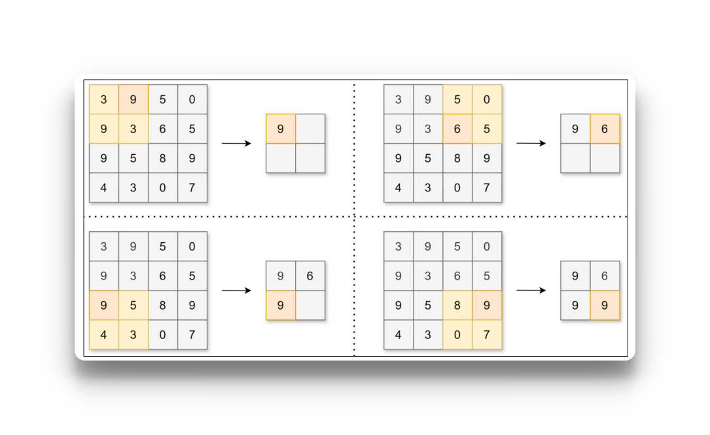
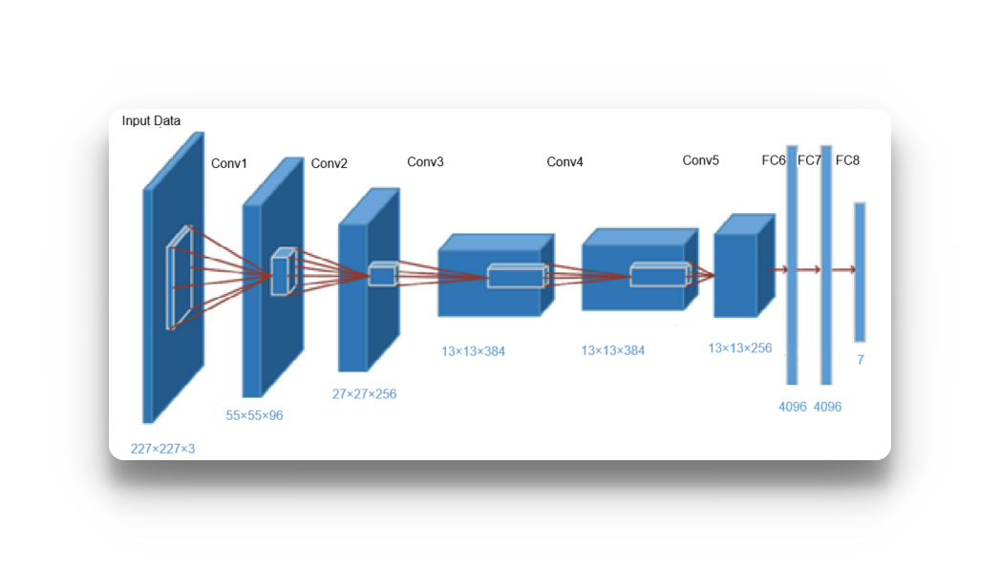
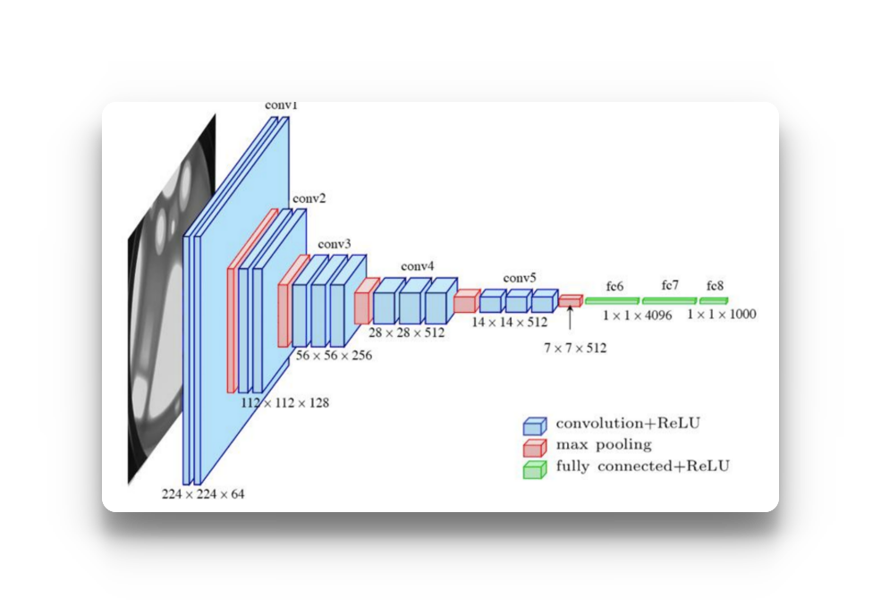
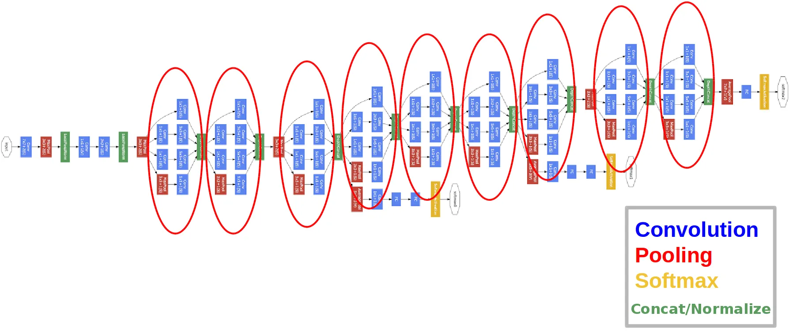
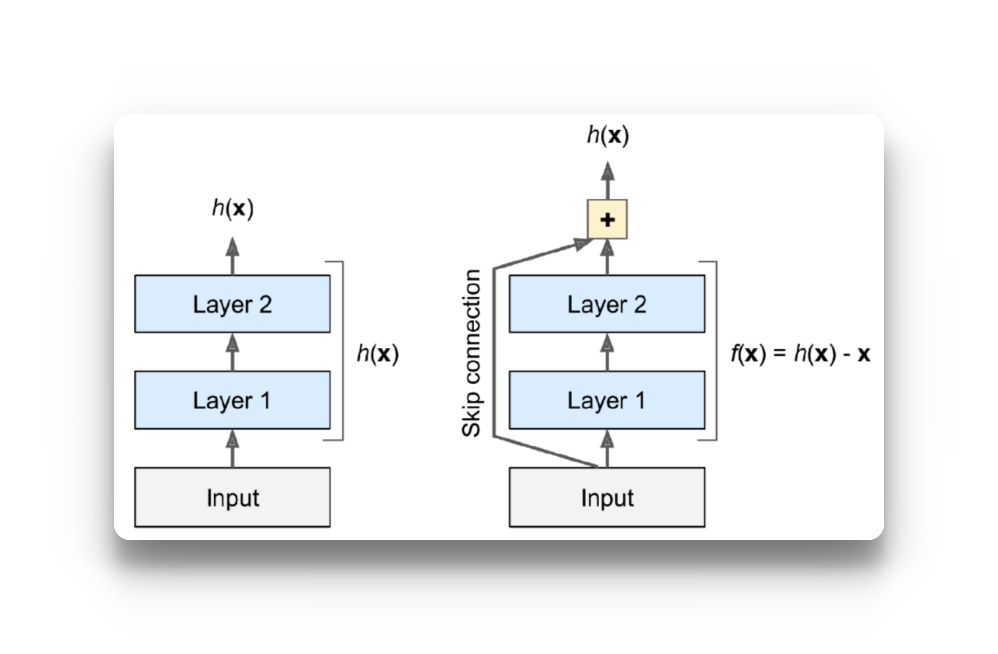
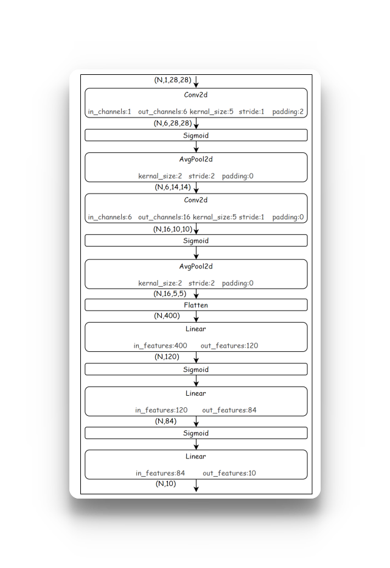

# 卷积神经网络
卷积神经网络（Convolutional Neural Network，CNN）常被用于图像识别、语音识别等各种场合。它在计算机视觉领域表现尤为出色，广泛应用于图像分类、目标检测、图像分割等任务。
卷积神经网络的灵感来自于动物视觉皮层组织的神经连接方式，单个神经元只对有限区域内的刺激作出反应，不同神经元的感知区域相互重叠从而覆盖整个视野。
CNN中新出现了卷积层（Convolution层）和池化层（Pooling层），下图是一个CNN的结构：


- **卷积层用于提取输入数据的局部特征**
- **池化层用于降维，增强鲁棒性并防止过拟合**
- 全连接层用于整合特征并输出结果

浅显的理解：卷积层负责“提取特征”，池化层负责“压缩特征”，全连接层负责“利用特征做判断”。
## 一、卷积层

### 1.1 卷积运算
**数学上的卷积是什么？**
假设有两个函数：

$$
f(x),\quad g(x)
$$

它们的卷积定义为：

$$
(f*g)(x) =\int_{-\infty}^{+\infty}f(t)g(x-t)\,dt
$$

把一个函数翻转并平移，然后与另一个函数对应位置相乘，最后把结果加起来。所以卷积本质上可以理解成：
**一个函数在另一个函数上“滑动”，每到一个位置，就计算两者在当前位置的匹配程度。**

**从一维卷积延伸到二维卷积**
图片本质上就是一个二维矩阵。
例如一张灰度图片：

$$
X=
\begin{bmatrix}
1&2&3&4\\
5&6&7&8\\
9&10&11&12\\
13&14&15&16
\end{bmatrix}
$$

现在定义一个小矩阵：

$$
K=
\begin{bmatrix}
1&0\\
0&-1
\end{bmatrix}
$$

这个小矩阵就是所谓的：**卷积核 Kernel**

然后让它在图片上滑动。
第一次：

$$
\begin{bmatrix}
\boxed1&\boxed2&3&4\\
\boxed5&\boxed6&7&8\\
9&10&11&12\\
13&14&15&16
\end{bmatrix}
$$

取出来：

$$
\begin{bmatrix}
1&2\\
5&6
\end{bmatrix}
$$

和卷积核对应位置相乘：

$$
1\times1+
2\times0+
5\times0+
6\times(-1)
=-5
$$

于是输出一个: -5
然后卷积核向右移动一格：

$$
\begin{bmatrix}
1&\boxed2&\boxed3&4\\
5&\boxed6&\boxed7&8\\
9&10&11&12\\
13&14&15&16
\end{bmatrix}
$$

继续：

$$
2\times1+3\times0+6\times0+7\times(-1)
=-5
$$

不断滑动，就得到一张新的矩阵：

$$
X \rightarrow K \rightarrow \text{Feature Map}
$$

这就是 CNN 中所谓的特征图（Feature Map）。

**为什么这种操作可以“提取特征”？**
假设有一个卷积核：

$$
K=
\begin{bmatrix}
-1&0&1\\
-1&0&1\\
-1&0&1
\end{bmatrix}
$$

它特别喜欢这样的区域：

> 暗 暗 | 亮
> 暗 暗 | 亮
> 暗 暗 | 亮

因为左边和右边像素差异很大。
卷积之后就可能产生一个很大的值。
也就是说：
如果图片的某个局部区域和卷积核描述的模式很相似，卷积结果就会产生明显响应

所以卷积核其实可以看成一个：
**“局部模式探测器”。**
例如：
卷积核 A → 喜欢竖直边缘

卷积核 B → 喜欢水平边缘

卷积核 C → 喜欢斜线

卷积核 D → 喜欢某种纹理

这就把数学上的卷积和 CNN 联系起来了：

$$
\boxed{
\text{卷积}
=\text{用一个小模板在数据上滑动，并计算局部响应}
}
$$

CNN中，卷积核的参数对应之前的权重。并且CNN中也存在偏置。


在图像中，一个颜色通常需要三个值来表示(RGB)，比如：
就是：
图片第 100 行、第 200 列这个像素的 RGB 值是 (213,150,82)。

> x[100, 200, 0]  # R
> x[100, 200, 1]  # G
> x[100, 200, 2]  # B

### 2.2 填充 padding
在进行卷积层的处理之前，有时要向输入数据的周围填入固定的数据（比如0），这称为填充（padding）。例如，对形状为4×4的数据进行幅度为1的填充，即用幅度为1、值为0的数据填充周围：


可以看到，4×4的数据进行幅度为1的填充后形状变为6×6，再经过卷积后数据的形状为4×4。**使用填充主要目的是为了调整输出数据的形状大小，避免多次卷积后数据形状大小过小导致无法继续进行卷积运算**。运用填充可以令数据形状在经过卷积运算后保持不变。

### 2.3 步幅 （stride）

应用卷积核的位置间隔称之为步幅（stride）。


可以看到填充和步幅都会影响输出数据的形状大小。增大填充，输出数据形状大小会变大；增大步幅，输出数据形状大小会变小。让我们分析一下给定填充和步幅如何计算输出数据的形状大小。

### 2.4 3维数据的卷积运算
图像是3维数据，除了长、宽外还需要处理通道方向。在3维数据的卷积运算中，输入数据的通道数和卷积核的通道数须设为相同的值。当有多个通道时，会按通道进行输入数据和卷积核的卷积运算，并将结果相加得到输出数据。


使用1个形状为C,FH,FW的卷积核，对形状为C,H,W的输入数据进行卷积运算，输出1张形状为OH,OW特征图，即输出的通道数为1。


**如果考虑偏置**


### 2.5 在pytorch中使用CNN
```python
torch.nn.Conv2d(in_channels, out_channels, kernel_size, stride, padding)
# in_channels:输入通道数
# out_channels:输出通道数 ,表示有表示有 out_channels 个完整的卷积核，每个完整卷积核的尺寸是 in_channels × kernel_size × kernel_size = 3×9×9
# kernel_size:卷积核大小
# stride:步幅
# padding:填充幅度
```
```python
import torch
import matplotlib.pyplot as plt
from pathlib import Path

data_dir = Path("/storage/data/尚硅谷ai/09_尚硅谷AI大模型之深度学习/2.资料/data")
img = plt.imread(data_dir / "duck.jpg")
print("图片数据形状：", img.shape)

# 将图片数据转换为张量并改变形状
input = torch.tensor(img).permute(2, 0, 1).float()
print("输入特征图形状：", input.shape)

"""
1. torch.tensor(img)
将输入（通常是numpy数组或PIL图像）转换为PyTorch张量。
2. .permute(2, 0, 1)
维度重排，这是关键操作：

原始图像通常是 HWC 格式：(Height, Width, Channels)

例如 (224, 224, 3) 表示 224×224 的RGB图像

PyTorch 卷积网络要求 CHW 格式：(Channels, Height, Width)

转换为 (3, 224, 224)

permute(2, 0, 1) 的含义：

新维度0 ← 原维度2（Channels）

新维度1 ← 原维度0（Height）

新维度2 ← 原维度1（Width）
"""
# 初始化卷积核
conv = torch.nn.Conv2d(in_channels=3, out_channels=3, kernel_size=9, stride=3, padding=0, bias=False)
print(conv.weight.shape) ## torch.Size([3, 3, 9, 9])
# 对输入特征图进行卷积操作
output = conv(input)
print("输出特征图形状：", output.shape)

# 将输出特征图转换为图片
output = torch.clamp(output.int(), 0, 255) # 限制输出在0到255之间
output = output.permute(1, 2, 0).detach().numpy()
fig, ax = plt.subplots(1, 2, figsize=(10, 5))
ax[0].imshow(img)
ax[1].imshow(output)
plt.axis("off")
plt.show()
```
```text
class Conv2d(
    # 输入特征图的通道数。
    # 例如 RGB 图片为 3，灰度图片为 1。
    in_channels: int,

    # 输出特征图的通道数，同时也决定了卷积核的数量。
    # 例如 out_channels=64，最终会产生 64 个输出特征图。
    out_channels: int,

    # 卷积核大小。
    # 可以写 3，表示 3×3；
    # 也可以写 (3, 5)，表示 3×5。
    kernel_size: _size_2_t,

    # 步长：卷积核每次移动多少个像素。
    # stride=1 表示每次移动 1 格；
    # stride=2 表示每次移动 2 格。
    stride: _size_2_t = 1,

    # 填充：在输入特征图边缘补多少像素。
    # padding=1 表示四周补 1 圈。
    # 常用于控制卷积后特征图的尺寸。
    padding: _size_2_t | str = 0,

    # 空洞卷积的膨胀率。
    # dilation=1：普通卷积，卷积核元素连续排列。
    # dilation=2：卷积核元素之间间隔 1 个位置，
    # 可以在不增加参数量的情况下扩大感受野。
    dilation: _size_2_t = 1,

    # 分组卷积。
    # groups=1：普通卷积，所有输入通道都参与每个输出通道的计算。
    # groups>1：将输入、输出通道分组后分别进行卷积。
    # groups=in_channels 时可用于深度卷积（Depthwise Convolution）。
    groups: int = 1,

    # 是否为每个输出通道添加一个可学习的偏置 b。
    # True：y = Conv(x) + b
    # False：不使用偏置。
    bias: bool = True,

    # padding 使用什么方式进行填充。
    # "zeros"     ：补 0，默认方式。
    # "reflect"   ：镜像反射填充。
    # "replicate" ：复制边缘像素。
    # "circular"  ：循环填充。
    padding_mode: Literal[
        'zeros', 'reflect', 'replicate', 'circular'
    ] = "zeros",

    # 指定卷积层参数存放在哪个设备。
    # 例如：
    # device="cpu"
    # device="cuda"
    device: Any | None = None,

    # 指定卷积层参数的数据类型。
    # 例如：
    # dtype=torch.float32
    # dtype=torch.float64
    dtype: Any | None = None
)
```

**为什么每次运行的结果不一致？**
因为每次定义卷积核，pytorch都会随机初始化不同的权重，所以这里卷积的结果是不同的，可以通过( `print(conv.weight[0]` )， 就可以拿到第0个完整卷积核的初始化权重

## 二、池化层 （Pooling）
池化层（Pooling）通常用于对卷积得到的**特征图进行下采样**。

简单来说：

> **卷积层负责提取特征，池化层负责压缩特征图，并尽可能保留重要特征。**

---

### 1. 为什么需要池化？

假设经过卷积后得到一个特征图：

```text
输入特征图：28 × 28

池化层缩小长、宽方向上的空间来进行降维，能够缩减模型的大小并提高计算速度。
```

例如，对数据进行步幅为2的2×2的 `Max池化`：


除了Max池化（计算窗口内的最大值），还有Average池化（平均池化，计算窗口内的平均值）等。一般会将池化的大小窗口和步幅设置为相同的值，比如2×2的窗口大小，步幅会设置为2。池化同样也可以设置填充。


**池化层和卷积层的区别**
池化层和卷积层虽然都是用一个“小窗口”在特征图上滑动，但它们的目的完全不同。
卷积层：学习和提取特征。
池化层：压缩特征图，保留重要信息。

| 对比 | 卷积层 Convolution | 池化层 Pooling |
|---|---|---|
| 主要作用 | **提取特征** | **压缩特征** |
| 有无可学习参数 | ✅ 有 | ❌ 通常没有 |
| 操作方式 | 加权求和 | 最大值 / 平均值 |
| 是否改变通道数 | 可以改变 | 通常不改变 |
| 是否改变宽高 | 可以 | 通常会减小 |
| 参数如何确定 | 反向传播学习 | 人为指定规则 |
| 常见层 | `Conv2d` | `MaxPool2d`、`AvgPool2d` |

 - 1.和卷积层不同，池化层没有要学习的参数，并且池化运算按通道独立进行，经过池化运算后数据的通道数不会发生变化。
 - 2.池化的另一个特点是对微小偏差具有鲁棒性，数据发生微小偏差时，池化可能会返回相同的结果。例如，数据在宽度方向上偏离1个元素，返回的结果不变。

### API使用
```python
class MaxPool2d(
    kernel_size,           # 池化窗口大小（kernel_size ✖️ kernel_size）
    stride=None,           # 步长
    padding=0,             # 填充
    dilation=1,            # 空洞（膨胀）
    return_indices=False,  # 是否返回最大值索引
    ceil_mode=False        # 输出尺寸取整方式
)
```

## 三、深度卷积神经网络

将神经网络的层数加深，可以更有效地提取层次信息，还可以减少参数数量，从而让学习更加高效。
基于CNN构建深度神经网络，可以提取出更多的图片信息，大幅提高图像识别精度。在人工智能的发展历程中，正是深度卷积神经网络，掀起了最近一轮深度学习的热潮。

### 3.1 AlexNet
2012年由Alex Krizhevsky、Ilya Sutskever与 Geoffrey Hinton合作提出，是一个基于CNN构建的神经网络模型，主要架构包含8层（5个卷积层+3个全连接层），激活函数使用 ReLU，最后经全连接层输出结果，并且使用了Dropout。


### 3.2 VGG
2014年由牛津大学 Visual Geometry Group（视觉几何组）提出。VGG网络由多个卷积-池化层堆叠构成，将有权重的层（卷积层或全连接层）叠加至 16 或 19 层，也被称为VGG-16和VGG-19。


VGG结构简单，应用性强，因此得到了大量技术人员的青睐。

### 3.3 GoogleNet

2014年由Google团队提出的深度卷积神经网络架构。


### 3.4 ResNet
2015年由微软团队（何恺明等人）提出，比之前的网络具有更深的结构。
为了解决深度网络的梯度消失问题，ResNet以 VGG 为基础，引入了“快捷结构”。这样一来，网络学习的目标就由原始的输出hx变为了hx−x，这被称为“残差学习”；引入的这个恒等映射被称为“残差连接”（或者“跳跃连接”），这种网络结构也被称为“残差网络”（Residual Network，ResNet）。


ResNet有效地解决了深度网络中的梯度消失和梯度爆炸问题，在加深层的同时，提高了网络性能。

api使用
```python
import torchvision.models as models
from torchvision.models.alexnet import AlexNet_Weights
# AlexNet使用

alex = models.alexnet(
    weights = AlexNet_Weights
)
print(alex)
"""
AlexNet(
  (features): Sequential(
    (0): Conv2d(3, 64, kernel_size=(11, 11), stride=(4, 4), padding=(2, 2))
    (1): ReLU(inplace=True)
    (2): MaxPool2d(kernel_size=3, stride=2, padding=0, dilation=1, ceil_mode=False)
    (3): Conv2d(64, 192, kernel_size=(5, 5), stride=(1, 1), padding=(2, 2))
    (4): ReLU(inplace=True)
    (5): MaxPool2d(kernel_size=3, stride=2, padding=0, dilation=1, ceil_mode=False)
    (6): Conv2d(192, 384, kernel_size=(3, 3), stride=(1, 1), padding=(1, 1))
    (7): ReLU(inplace=True)
    (8): Conv2d(384, 256, kernel_size=(3, 3), stride=(1, 1), padding=(1, 1))
    (9): ReLU(inplace=True)
    (10): Conv2d(256, 256, kernel_size=(3, 3), stride=(1, 1), padding=(1, 1))
    (11): ReLU(inplace=True)
    (12): MaxPool2d(kernel_size=3, stride=2, padding=0, dilation=1, ceil_mode=False)
  )
  (avgpool): AdaptiveAvgPool2d(output_size=(6, 6))
  (classifier): Sequential(
    (0): Dropout(p=0.5, inplace=False)
    (1): Linear(in_features=9216, out_features=4096, bias=True)
    (2): ReLU(inplace=True)
    (3): Dropout(p=0.5, inplace=False)
    (4): Linear(in_features=4096, out_features=4096, bias=True)
    (5): ReLU(inplace=True)
    (6): Linear(in_features=4096, out_features=1000, bias=True)
  )
)

"""
vgg16 = models.vgg16()
print(vgg16)
"""
VGG(
  (features): Sequential(
    (0): Conv2d(3, 64, kernel_size=(3, 3), stride=(1, 1), padding=(1, 1))
    (1): ReLU(inplace=True)
    (2): Conv2d(64, 64, kernel_size=(3, 3), stride=(1, 1), padding=(1, 1))
    (3): ReLU(inplace=True)
    (4): MaxPool2d(kernel_size=2, stride=2, padding=0, dilation=1, ceil_mode=False)
    (5): Conv2d(64, 128, kernel_size=(3, 3), stride=(1, 1), padding=(1, 1))
    (6): ReLU(inplace=True)
    (7): Conv2d(128, 128, kernel_size=(3, 3), stride=(1, 1), padding=(1, 1))
    (8): ReLU(inplace=True)
    (9): MaxPool2d(kernel_size=2, stride=2, padding=0, dilation=1, ceil_mode=False)
    (10): Conv2d(128, 256, kernel_size=(3, 3), stride=(1, 1), padding=(1, 1))
    (11): ReLU(inplace=True)
    (12): Conv2d(256, 256, kernel_size=(3, 3), stride=(1, 1), padding=(1, 1))
    (13): ReLU(inplace=True)
    (14): Conv2d(256, 256, kernel_size=(3, 3), stride=(1, 1), padding=(1, 1))
    (15): ReLU(inplace=True)
    (16): MaxPool2d(kernel_size=2, stride=2, padding=0, dilation=1, ceil_mode=False)
    (17): Conv2d(256, 512, kernel_size=(3, 3), stride=(1, 1), padding=(1, 1))
    (18): ReLU(inplace=True)
    (19): Conv2d(512, 512, kernel_size=(3, 3), stride=(1, 1), padding=(1, 1))
    (20): ReLU(inplace=True)
    (21): Conv2d(512, 512, kernel_size=(3, 3), stride=(1, 1), padding=(1, 1))
    (22): ReLU(inplace=True)
    (23): MaxPool2d(kernel_size=2, stride=2, padding=0, dilation=1, ceil_mode=False)
    (24): Conv2d(512, 512, kernel_size=(3, 3), stride=(1, 1), padding=(1, 1))
    (25): ReLU(inplace=True)
    (26): Conv2d(512, 512, kernel_size=(3, 3), stride=(1, 1), padding=(1, 1))
    (27): ReLU(inplace=True)
    (28): Conv2d(512, 512, kernel_size=(3, 3), stride=(1, 1), padding=(1, 1))
    (29): ReLU(inplace=True)
    (30): MaxPool2d(kernel_size=2, stride=2, padding=0, dilation=1, ceil_mode=False)
  )
  (avgpool): AdaptiveAvgPool2d(output_size=(7, 7))
  (classifier): Sequential(
    (0): Linear(in_features=25088, out_features=4096, bias=True)
    (1): ReLU(inplace=True)
    (2): Dropout(p=0.5, inplace=False)
    (3): Linear(in_features=4096, out_features=4096, bias=True)
    (4): ReLU(inplace=True)
    (5): Dropout(p=0.5, inplace=False)
    (6): Linear(in_features=4096, out_features=1000, bias=True)
  )
)
"""
googleNet = models.googlenet(init_weights=True)
print(googleNet)

resnet = models.resnet50()
print(resnet)
```

### 使用案例：使用Kaggle数据集中的服装数据进行服装分类

数据集中每个样本都是28×28的灰度图像，与来自10个类别的标签相关联。标签对应如下：
0：T恤/上衣
1：裤子
2：套头衫
3：连衣裙
4：外套
5：凉鞋
6：衬衫
7：运动鞋
8：包
9：靴子



```python
import torch
import pandas as pd
import torch.nn as nn
from torch.utils.data import TensorDataset, DataLoader
from pathlib import Path


# ============================================================
# 1. 读取数据
# ============================================================

data_dir = Path(
    "/storage/data/尚硅谷ai/09_尚硅谷AI大模型之深度学习/2.资料/data"
)

fashion_mnist_train = pd.read_csv(
    data_dir / "fashion-mnist_train.csv"
)

fashion_mnist_test = pd.read_csv(
    data_dir / "fashion-mnist_test.csv"
)


# ============================================================
# 2. 转换为 Tensor
# ============================================================

# 原始像素范围 0~255，归一化到 0~1
X_train = torch.tensor(
    fashion_mnist_train.iloc[:, 1:].values,
    dtype=torch.float32
).reshape(-1, 1, 28, 28) / 255.0

y_train = torch.tensor(
    fashion_mnist_train.iloc[:, 0].values,
    dtype=torch.int64
)

X_test = torch.tensor(
    fashion_mnist_test.iloc[:, 1:].values,
    dtype=torch.float32
).reshape(-1, 1, 28, 28) / 255.0

y_test = torch.tensor(
    fashion_mnist_test.iloc[:, 0].values,
    dtype=torch.int64
)


# ============================================================
# 3. 构建数据集
# ============================================================

train_dataset = TensorDataset(X_train, y_train)
test_dataset = TensorDataset(X_test, y_test)


# ============================================================
# 4. 构建 LeNet 风格 CNN
# ============================================================

model = nn.Sequential(

    # (N, 1, 28, 28)
    nn.Conv2d(
        in_channels=1,
        out_channels=6,
        kernel_size=5,
        stride=1,
        padding=2
    ),

    # (N, 6, 28, 28)
    nn.ReLU(),

    # (N, 6, 14, 14)
    nn.AvgPool2d(
        kernel_size=2,
        stride=2
    ),

    # (N, 16, 10, 10)
    nn.Conv2d(
        in_channels=6,
        out_channels=16,
        kernel_size=5,
        stride=1,
        padding=0
    ),

    nn.ReLU(),

    # (N, 16, 5, 5)
    nn.AvgPool2d(
        kernel_size=2,
        stride=2
    ),

    # (N, 400)
    nn.Flatten(),

    nn.Linear(16 * 5 * 5, 120),
    nn.ReLU(),

    nn.Linear(120, 84),
    nn.ReLU(),

    # 最终输出 logits：(N, 10)
    nn.Linear(84, 10)
)


# ============================================================
# 5. 查看每一层输出形状
# ============================================================

X = torch.rand(
    size=(100, 1, 28, 28),
    dtype=torch.float32
)

print("模型各层输出：")

for layer in model:
    X = layer(X)

    print(
        f"{layer.__class__.__name__:<12} "
        f"output shape: {X.shape}"
    )


# ============================================================
# 6. 训练函数
# ============================================================

def train(
    model,
    train_dataset,
    test_dataset,
    lr,
    epochs,
    batch_size,
    device
):

    # --------------------------------------------------------
    # 初始化模型参数
    # --------------------------------------------------------

    # PyTorch 本身已经有默认初始化方式。
    # 如果希望手动使用 Xavier，可以打开下面代码。

    # def init_weights(layer):
    #     if isinstance(layer, (nn.Linear, nn.Conv2d)):
    #         nn.init.xavier_uniform_(layer.weight)
    #
    #         if layer.bias is not None:
    #             nn.init.zeros_(layer.bias)
    #
    # model.apply(init_weights)

    # --------------------------------------------------------
    # 将模型放到 CPU / GPU
    # --------------------------------------------------------

    model.to(device)

    # --------------------------------------------------------
    # 损失函数
    # --------------------------------------------------------

    loss_fn = nn.CrossEntropyLoss()
    # --------------------------------------------------------
    # 优化器
    # --------------------------------------------------------

    optimizer = torch.optim.AdamW(
        model.parameters(),
        lr=lr,
        weight_decay=0.01
    )

    # --------------------------------------------------------
    # DataLoader
    #
    # 不需要每个 epoch 都重新创建
    # --------------------------------------------------------

    train_loader = DataLoader(
        dataset=train_dataset,
        batch_size=batch_size,
        shuffle=True
    )

    test_loader = DataLoader(
        dataset=test_dataset,
        batch_size=batch_size,
        shuffle=False
    )
    # ========================================================
    # 开始训练
    # ========================================================
    for epoch in range(epochs):
        # ====================================================
        # 一、训练阶段
        # ====================================================
        model.train()
        # 累计损失
        loss_accumulate = 0.0
        # 累计预测正确数量
        train_correct_accumulate = 0
        # 累计已经训练过的样本数量
        train_total = 0

        for batch_count, (X, y) in enumerate(train_loader):

            # -----------------------------------------------
            # 1. 数据移动到设备
            # -----------------------------------------------
            X = X.to(device)
            y = y.to(device)
            # -----------------------------------------------
            # 2. 前向传播
            # -----------------------------------------------
            output = model(X)
            # -----------------------------------------------
            # 3. 计算损失
            # -----------------------------------------------
            loss_value = loss_fn(output, y)
            # -----------------------------------------------
            # 4. 清空梯度
            # -----------------------------------------------
            optimizer.zero_grad()
            # -----------------------------------------------
            # 5. 反向传播
            # -----------------------------------------------
            loss_value.backward()
            # -----------------------------------------------
            # 6. 更新参数
            # -----------------------------------------------
            optimizer.step()
            # -----------------------------------------------
            # 7. 累加 loss
            # -----------------------------------------------
            loss_accumulate += loss_value.item()

            # -----------------------------------------------
            # 8. 获得预测类别
            #
            # output:
            # (batch_size, 10)
            #
            # 在 dim=1 上寻找最大值对应的位置
            # -----------------------------------------------
            pred = output.argmax(dim=1)
            # -----------------------------------------------
            # 9. 统计预测正确数量
            # -----------------------------------------------
            train_correct_accumulate += (
                pred.eq(y).sum().item()
            )
            # -----------------------------------------------
            # 10. 统计已经处理的样本数量
            # -----------------------------------------------
            train_total += y.size(0)
            # -----------------------------------------------
            # 11. 当前平均 loss
            #
            # 注意：
            # 这里不能除以 len(train_loader)
            #
            # 因为当前只训练了 batch_count + 1 个 batch
            # -----------------------------------------------
            current_loss = (
                loss_accumulate /
                (batch_count + 1)
            )
            # -----------------------------------------------
            # 12. 当前训练准确率
            #
            # 注意：
            # 这里不能直接除 len(train_dataset)
            #
            # 因为当前只处理了 train_total 个样本
            # -----------------------------------------------
            current_train_acc = (
                train_correct_accumulate /
                train_total
            )
            # -----------------------------------------------
            # 13. 显示训练进度
            # -----------------------------------------------
            progress = int(
                (batch_count + 1)
                / len(train_loader)
                * 50
            )
            print(
                f"\r"
                f"epoch:{epoch + 1:02d} "
                f"[{'=' * progress:<50}] "
                f"loss:{current_loss:.6f} "
                f"train_acc:{current_train_acc:.4f}",
                end=""
            )
        # ====================================================
        # 当前 epoch 最终训练结果
        # ====================================================
        train_loss = (
            loss_accumulate /
            len(train_loader)
        )
        train_acc = (
            train_correct_accumulate /
            len(train_dataset)
        )
        # ====================================================
        # 二、验证阶段
        # ====================================================
        model.eval()
        test_correct_accumulate = 0
        # 关闭自动求导
        with torch.no_grad():

            for X, y in test_loader:

                X = X.to(device)
                y = y.to(device)
                # 前向传播
                output = model(X)
                # 获得预测类别
                pred = output.argmax(dim=1)
                # 累加预测正确数量
                test_correct_accumulate += (
                    pred.eq(y).sum().item()
                )
        # ====================================================
        # 测试集准确率
        # ====================================================
        test_acc = (
            test_correct_accumulate /
            len(test_dataset)
        )
        # ====================================================
        # 输出当前 epoch 最终结果
        # ====================================================
        print(
            f"\r"
            f"epoch:{epoch + 1:02d} "
            f"[{'=' * 50}] "
            f"loss:{train_loss:.6f}, "
            f"train_acc:{train_acc:.4f}, "
            f"test_acc:{test_acc:.4f}"
        )

# ============================================================
# 7. 选择计算设备
# ============================================================

device = torch.device(
    "cuda"
    if torch.cuda.is_available()
    else "cpu"
)

print(f"\n使用设备: {device}")
# ============================================================
# 8. 开始训练
# ============================================================
train(
    model=model,
    train_dataset=train_dataset,
    test_dataset=test_dataset,
    lr=0.001,
    epochs=50,
    batch_size=256,
    device=device
)
```

> ```
> epoch:01 [==================================================] loss:0.926659, train_acc:0.6629, test_acc:0.7599
> epoch:02 [==================================================] loss:0.583356, train_acc:0.7771, test_acc:0.7885
> epoch:03 [==================================================] loss:0.509685, train_acc:0.8119, test_acc:0.8276
> epoch:04 [==================================================] loss:0.460644, train_acc:0.8330, test_acc:0.8418
> epoch:05 [==================================================] loss:0.429724, train_acc:0.8430, test_acc:0.8528
> epoch:06 [==================================================] loss:0.401483, train_acc:0.8535, test_acc:0.8642
> epoch:07 [==================================================] loss:0.377916, train_acc:0.8620, test_acc:0.8582
> epoch:08 [==================================================] loss:0.359600, train_acc:0.8683, test_acc:0.8716
> epoch:09 [==================================================] loss:0.345094, train_acc:0.8743, test_acc:0.8799
> epoch:10 [==================================================] loss:0.331949, train_acc:0.8780, test_acc:0.8726
> ```