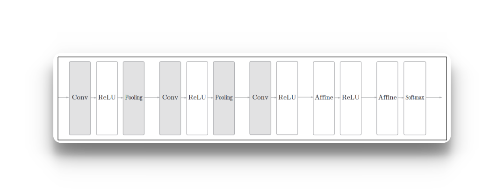
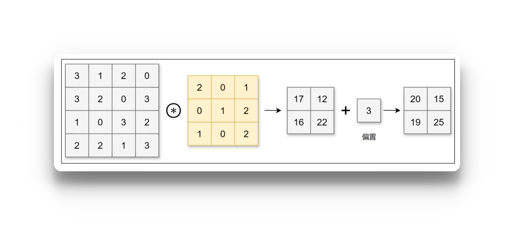
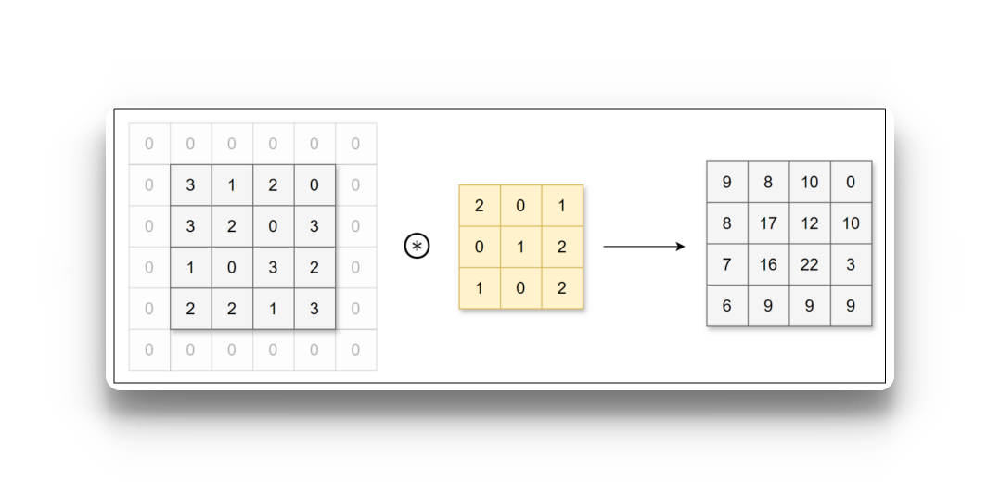
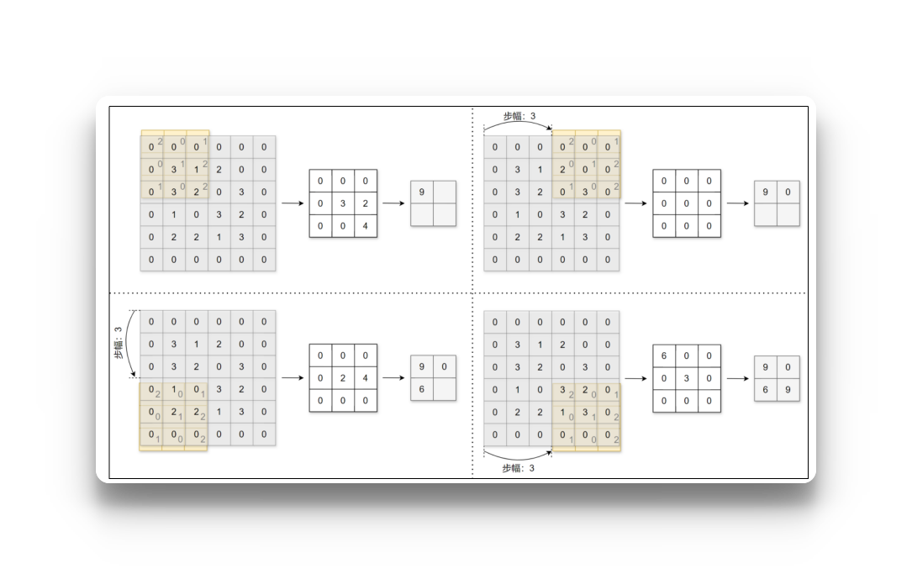
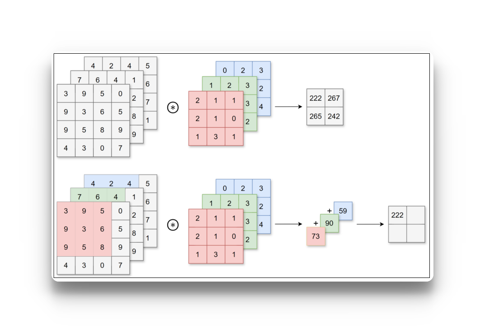
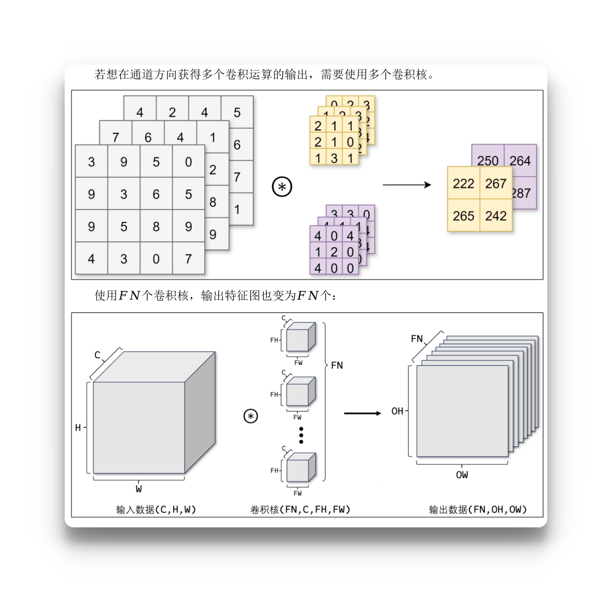
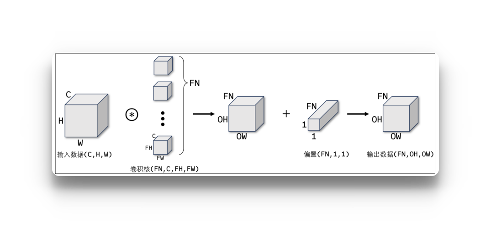

# 卷积神经网络
卷积神经网络（Convolutional Neural Network，CNN）常被用于图像识别、语音识别等各种场合。它在计算机视觉领域表现尤为出色，广泛应用于图像分类、目标检测、图像分割等任务。
卷积神经网络的灵感来自于动物视觉皮层组织的神经连接方式，单个神经元只对有限区域内的刺激作出反应，不同神经元的感知区域相互重叠从而覆盖整个视野。
CNN中新出现了卷积层（Convolution层）和池化层（Pooling层），下图是一个CNN的结构：


- **卷积层用于提取输入数据的局部特征**
- **池化层用于降维，增强鲁棒性并防止过拟合**
- 全连接层用于整合特征并输出结果

浅显的理解：卷积层负责“提取特征”，池化层负责“压缩特征”，全连接层负责“利用特征做判断”。
# 一、卷积层

## 1.1 卷积运算
**数学上的卷积是什么？**
假设有两个函数：

$$
f(x),\quad g(x)
$$

它们的卷积定义为：

$$
(f*g)(x) =\int_{-\infty}^{+\infty}f(t)g(x-t)\,dt
$$

把一个函数翻转并平移，然后与另一个函数对应位置相乘，最后把结果加起来。所以卷积本质上可以理解成：
**一个函数在另一个函数上“滑动”，每到一个位置，就计算两者在当前位置的匹配程度。**

**从一维卷积延伸到二维卷积**
图片本质上就是一个二维矩阵。
例如一张灰度图片：

$$
X=
\begin{bmatrix}
1&2&3&4\\
5&6&7&8\\
9&10&11&12\\
13&14&15&16
\end{bmatrix}
$$

现在定义一个小矩阵：

$$
K=
\begin{bmatrix}
1&0\\
0&-1
\end{bmatrix}
$$

这个小矩阵就是所谓的：**卷积核 Kernel**

然后让它在图片上滑动。
第一次：

$$
\begin{bmatrix}
\boxed1&\boxed2&3&4\\
\boxed5&\boxed6&7&8\\
9&10&11&12\\
13&14&15&16
\end{bmatrix}
$$

取出来：

$$
\begin{bmatrix}
1&2\\
5&6
\end{bmatrix}
$$

和卷积核对应位置相乘：

$$
1\times1+
2\times0+
5\times0+
6\times(-1)
=-5
$$

于是输出一个: -5
然后卷积核向右移动一格：

$$
\begin{bmatrix}
1&\boxed2&\boxed3&4\\
5&\boxed6&\boxed7&8\\
9&10&11&12\\
13&14&15&16
\end{bmatrix}
$$

继续：

$$
2\times1+3\times0+6\times0+7\times(-1)
=-5
$$

不断滑动，就得到一张新的矩阵：

$$
X \rightarrow K \rightarrow \text{Feature Map}
$$

这就是 CNN 中所谓的特征图（Feature Map）。

**为什么这种操作可以“提取特征”？**
假设有一个卷积核：

$$
K=
\begin{bmatrix}
-1&0&1\\
-1&0&1\\
-1&0&1
\end{bmatrix}
$$

它特别喜欢这样的区域：

> 暗 暗 | 亮
> 暗 暗 | 亮
> 暗 暗 | 亮

因为左边和右边像素差异很大。
卷积之后就可能产生一个很大的值。
也就是说：
如果图片的某个局部区域和卷积核描述的模式很相似，卷积结果就会产生明显响应

所以卷积核其实可以看成一个：
**“局部模式探测器”。**
例如：
卷积核 A → 喜欢竖直边缘

卷积核 B → 喜欢水平边缘

卷积核 C → 喜欢斜线

卷积核 D → 喜欢某种纹理

这就把数学上的卷积和 CNN 联系起来了：

$$
\boxed{
\text{卷积}
=\text{用一个小模板在数据上滑动，并计算局部响应}
}
$$

CNN中，卷积核的参数对应之前的权重。并且CNN中也存在偏置。


在图像中，一个颜色通常需要三个值来表示(RGB)，比如：
就是：
图片第 100 行、第 200 列这个像素的 RGB 值是 (213,150,82)。

> x[100, 200, 0]  # R
> x[100, 200, 1]  # G
> x[100, 200, 2]  # B

## 2.2 填充 padding
在进行卷积层的处理之前，有时要向输入数据的周围填入固定的数据（比如0），这称为填充（padding）。例如，对形状为4×4的数据进行幅度为1的填充，即用幅度为1、值为0的数据填充周围：


可以看到，4×4的数据进行幅度为1的填充后形状变为6×6，再经过卷积后数据的形状为4×4。**使用填充主要目的是为了调整输出数据的形状大小，避免多次卷积后数据形状大小过小导致无法继续进行卷积运算**。运用填充可以令数据形状在经过卷积运算后保持不变。

## 2.3 步幅 （stride）

应用卷积核的位置间隔称之为步幅（stride）。


可以看到填充和步幅都会影响输出数据的形状大小。增大填充，输出数据形状大小会变大；增大步幅，输出数据形状大小会变小。让我们分析一下给定填充和步幅如何计算输出数据的形状大小。

## 2.4 3维数据的卷积运算
图像是3维数据，除了长、宽外还需要处理通道方向。在3维数据的卷积运算中，输入数据的通道数和卷积核的通道数须设为相同的值。当有多个通道时，会按通道进行输入数据和卷积核的卷积运算，并将结果相加得到输出数据。


使用1个形状为C,FH,FW的卷积核，对形状为C,H,W的输入数据进行卷积运算，输出1张形状为OH,OW特征图，即输出的通道数为1。


**如果考虑偏置**


## 2.5 在pytorch中使用CNN
```python
torch.nn.Conv2d(in_channels, out_channels, kernel_size, stride, padding)
# in_channels:输入通道数
# out_channels:输出通道数 ,表示有表示有 out_channels 个完整的卷积核，每个完整卷积核的尺寸是 in_channels × kernel_size × kernel_size = 3×9×9
# kernel_size:卷积核大小
# stride:步幅
# padding:填充幅度
```
```python
import torch
import matplotlib.pyplot as plt
from pathlib import Path

data_dir = Path("/storage/data/尚硅谷ai/09_尚硅谷AI大模型之深度学习/2.资料/data")
img = plt.imread(data_dir / "duck.jpg")
print("图片数据形状：", img.shape)

# 将图片数据转换为张量并改变形状
input = torch.tensor(img).permute(2, 0, 1).float()
print("输入特征图形状：", input.shape)

"""
1. torch.tensor(img)
将输入（通常是numpy数组或PIL图像）转换为PyTorch张量。
2. .permute(2, 0, 1)
维度重排，这是关键操作：

原始图像通常是 HWC 格式：(Height, Width, Channels)

例如 (224, 224, 3) 表示 224×224 的RGB图像

PyTorch 卷积网络要求 CHW 格式：(Channels, Height, Width)

转换为 (3, 224, 224)

permute(2, 0, 1) 的含义：

新维度0 ← 原维度2（Channels）

新维度1 ← 原维度0（Height）

新维度2 ← 原维度1（Width）
"""
# 初始化卷积核
conv = torch.nn.Conv2d(in_channels=3, out_channels=3, kernel_size=9, stride=3, padding=0, bias=False)
print(conv.weight.shape) ## torch.Size([3, 3, 9, 9])
# 对输入特征图进行卷积操作
output = conv(input)
print("输出特征图形状：", output.shape)

# 将输出特征图转换为图片
output = torch.clamp(output.int(), 0, 255) # 限制输出在0到255之间
output = output.permute(1, 2, 0).detach().numpy()
fig, ax = plt.subplots(1, 2, figsize=(10, 5))
ax[0].imshow(img)
ax[1].imshow(output)
plt.axis("off")
plt.show()
```
```text
class Conv2d(
    # 输入特征图的通道数。
    # 例如 RGB 图片为 3，灰度图片为 1。
    in_channels: int,

    # 输出特征图的通道数，同时也决定了卷积核的数量。
    # 例如 out_channels=64，最终会产生 64 个输出特征图。
    out_channels: int,

    # 卷积核大小。
    # 可以写 3，表示 3×3；
    # 也可以写 (3, 5)，表示 3×5。
    kernel_size: _size_2_t,

    # 步长：卷积核每次移动多少个像素。
    # stride=1 表示每次移动 1 格；
    # stride=2 表示每次移动 2 格。
    stride: _size_2_t = 1,

    # 填充：在输入特征图边缘补多少像素。
    # padding=1 表示四周补 1 圈。
    # 常用于控制卷积后特征图的尺寸。
    padding: _size_2_t | str = 0,

    # 空洞卷积的膨胀率。
    # dilation=1：普通卷积，卷积核元素连续排列。
    # dilation=2：卷积核元素之间间隔 1 个位置，
    # 可以在不增加参数量的情况下扩大感受野。
    dilation: _size_2_t = 1,

    # 分组卷积。
    # groups=1：普通卷积，所有输入通道都参与每个输出通道的计算。
    # groups>1：将输入、输出通道分组后分别进行卷积。
    # groups=in_channels 时可用于深度卷积（Depthwise Convolution）。
    groups: int = 1,

    # 是否为每个输出通道添加一个可学习的偏置 b。
    # True：y = Conv(x) + b
    # False：不使用偏置。
    bias: bool = True,

    # padding 使用什么方式进行填充。
    # "zeros"     ：补 0，默认方式。
    # "reflect"   ：镜像反射填充。
    # "replicate" ：复制边缘像素。
    # "circular"  ：循环填充。
    padding_mode: Literal[
        'zeros', 'reflect', 'replicate', 'circular'
    ] = "zeros",

    # 指定卷积层参数存放在哪个设备。
    # 例如：
    # device="cpu"
    # device="cuda"
    device: Any | None = None,

    # 指定卷积层参数的数据类型。
    # 例如：
    # dtype=torch.float32
    # dtype=torch.float64
    dtype: Any | None = None
)
```

**为什么每次运行的结果不一致？**
因为每次定义卷积核，pytorch都会随机初始化不同的权重，所以这里卷积的结果是不同的，可以通过( `print(conv.weight[0]` )， 就可以拿到第0个完整卷积核的初始化权重
