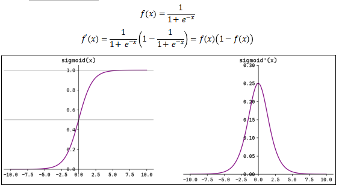
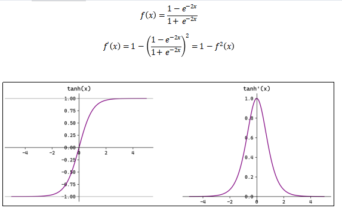
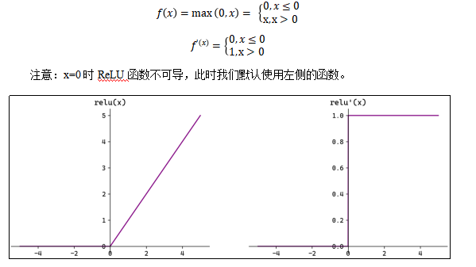
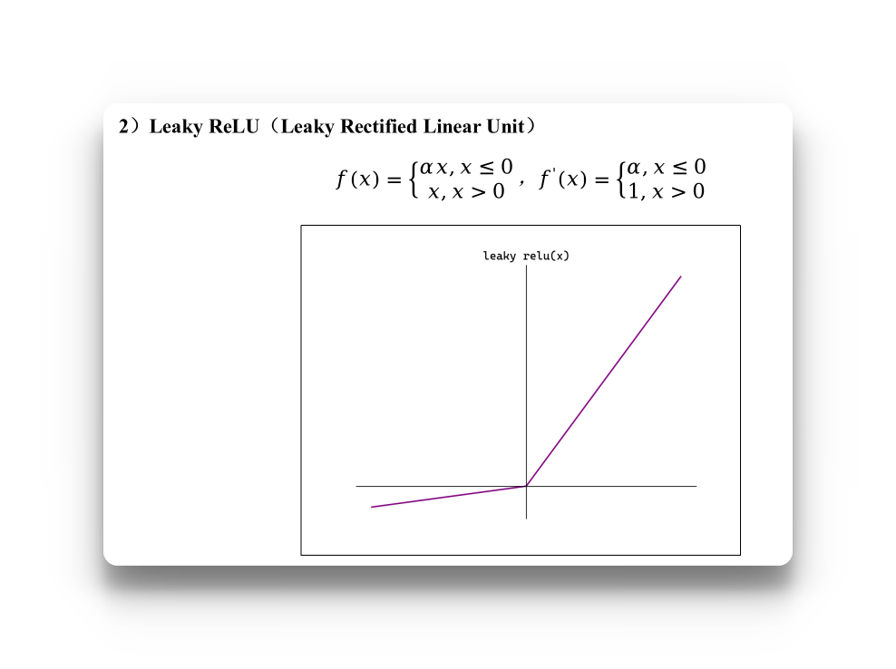
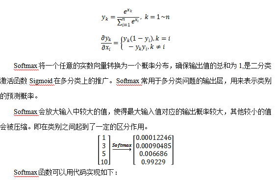
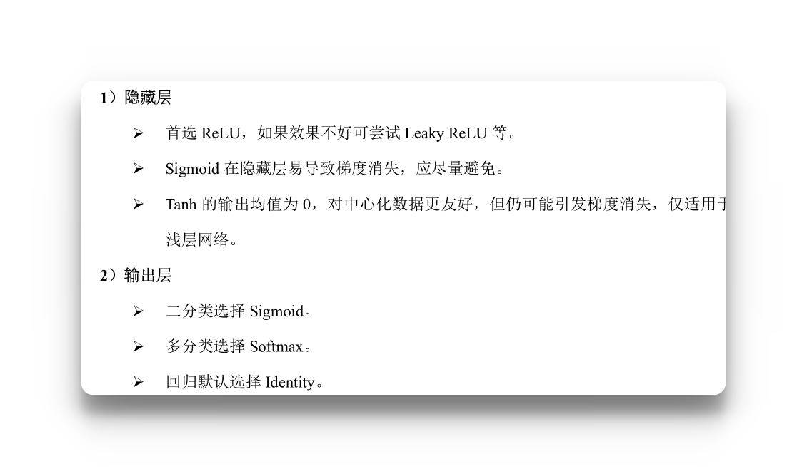
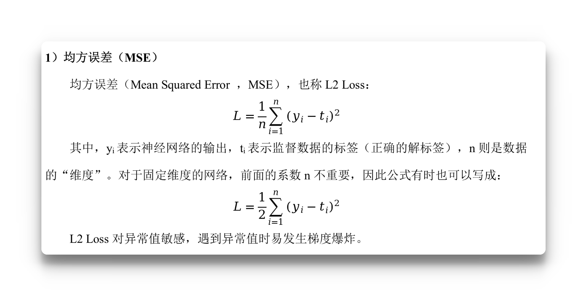
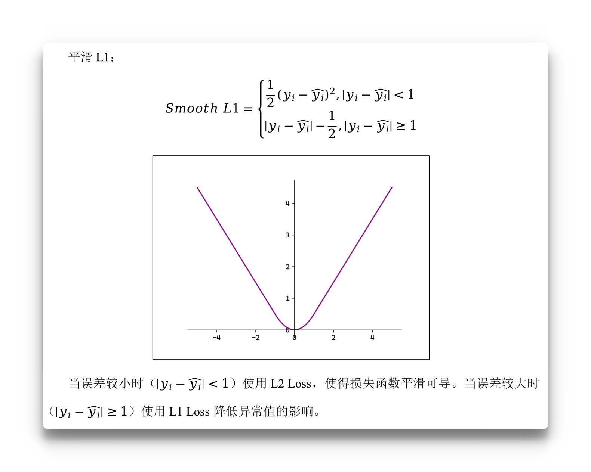
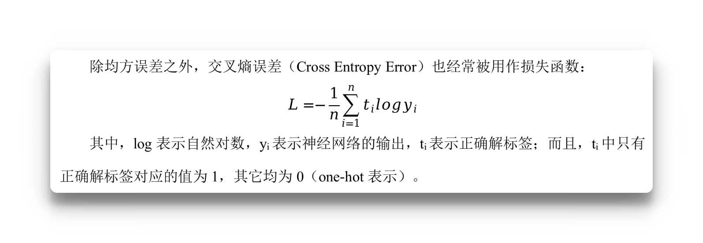

### 二、常见激活函数

激活函数是连接感知机和神经网络的桥梁，在神经网络中起着至关重要的作用。
如果没有激活函数，整个神经网络就等效于单层线性变换，不论如何加深层数，总是存在与之等效的“无隐藏层的神经网络”。激活函数必须是非线性函数，也正是激活函数的存在为神经网络引入了非线性，使得神经网络能够学习和表示复杂的非线性关系

#### 2.1 Sigmoid函数



```python
def sigmoid(x:np.ndarray):
    return 1 / (1 + np.exp(x))
```

#### 2.2 Tanh函数



```python
def Tanh(x: np.ndarray):
    exp_x = np.exp(-2 * x)
    return (1 - exp_x) / (1 + exp_x)
```

#### 2.3 ReLU函数



```python
def ReLU(x: np.ndarray):
    return np.maximum(0, x)
```

当输入小于的0的时候，激活函数的输出为0，这就意味着在神经网络中，ReLU激活的节点只有部分是活跃的，这种稀疏性有助于减少计算量和提高模型的效率。
但是当神经元的输出持续为负数的时候，ReLU的输出始终为0,这可能意味着神经元永远不可能被激活，从而导致“神经元死亡”的问题，这可能会影响模型的学习能力。因此可以引入LeakyReLU来代替ReLU


通过在负数区引入一个很小的斜率来解决“神经元死亡”的问题

```python
def leakyReLU(x:np.ndarray, alpha:float = 0.01):
    return np.maximum(alpha * x ,x)
```

#### 2.4 Softmax 函数



**理解**：softmax的输入函数是一个二维矩阵，行是样本，列是标签，元素是各个样本在不同标签的评分，现在softmax的目标就是将这个得分转化为样本取不同标签的概率

```python
def softmax(x: np.ndarray):  # 这里的x是二维数组
    x = x - np.max(x, axis=1, keepdims=True)
    exp_x = np.exp(x)
    y = exp_x / np.sum(exp_x, axis=1, keepdims=True)
    return y
```

> keepdims=True 的作用，就是求完最大值/求和以后，保留那个被压缩的维度，方便后面的广播。

**理解**：这里为什么要 `x = x - np.max(x, axis=1)` ？
是防止有些值过大，导致指数计算溢出，而且这样是不影响结果的，因为你看softmax的公式，分子分母都是指数，而且没有常数项，而我们这里计算的是个分数，所以分子分母同时除以一个数，这个分数大小是不会变化的

#### 激活函数的选择



## 三、神经网络的损失函数

#### 3.1 回归问题的损失函数

##### 3.1.1 MSE



```python
def mean_squared_error(y:np.ndarray,t:np.ndarray):
    return (1/batch_size) * np.sum((y - t)**2)
```
##### 3.1.2 3）Smooth L1

这个损失函数处处可导
##### 3.2 分类问题损失函数

###### 3.2.1 交叉熵误差


**理解**：其实这个公式很好理解，比如我现在模型输出的是 （bath_size,10）的这样一个矩阵，对应的是batch_size个样本在不同标签下的概率，因为每个样本都有自己的损失，那么这个交叉熵的损失就是每一行中预测对了的那个概率的对数值，然后所有行的对数值求和（就是这个batch的总损失）再取负号。
为什么要求和 ?，因为这里算的是这个batch的平均损失，所以要除以一个batch的数量。如果是一个样本，那么模型输出的就是（1，10）的矩阵，此时这个求和符号就可以不要了，因为取完log之后就是这个样本的损失

```python
def cross_entropy_error(y:np.ndarray,t:np.ndarray):
    batch_size = t.shape[0]
    ##如果t（标签矩阵）没有经过独热编码，那么这个我们可以直接用t中的值作为下标去取y中的概率，那么就是预测为正确标签的那个概率
    loss_sum1 = np.sum(
        -np.log( y[np.arange(batch_size), t]+1e-7)
    ) ## 加上1e-7是为了防止预测对了的那个概率太小导致负无穷
    # 如果标签矩阵t经过了独热编码呢？
    # 那么这里可以推断出，y和t的矩阵形状一定是一样的，那么直接对应位置元素相乘再取log即可，因为t中只有预测对了的那个位置的值是1
    loss_sum2 = np.sum(
        -t  * np.log(y + 1e-7)
    )
    # 所以对应返回即可
    if y.ndim != 1: # 标签矩阵是经过了独热编码的
        return loss_sum2 / batch_size
    return loss_sum1/ batch_size
```

显然loss_sum1的计算方式更好，不需要做矩阵运算，所以遇到经过了One-Hot编码的标签矩阵，我们可以把它转换为原来的、未经过编码的标签矩阵
所以可以这么写：

```python
def cross_entropy_error(y:np.ndarray,t:np.ndarray):
    
    if y.ndim == 1: #如果是输入一个样本，那么还是将其转化为二维矩阵
        y = y.reshape(1,y.size)
        t = t.reshape(1,t.size)
    if t.size == y.size: #也就是说经过了独热编码
        # 转换
        t = t.argmax(axis=1) #返回的是最大值所在的索引（下标）
    batch_size = t.shape[0]
    loss_sum = -np.sum(
        np.log( y[np.arange(batch_size), t]+1e-7)
    ) 
    return loss_sum/ batch_size
```
