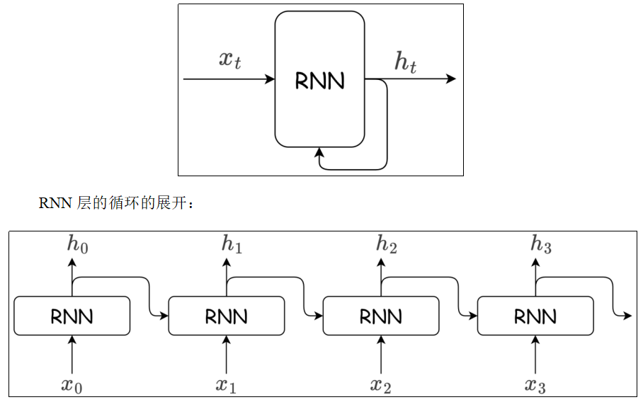
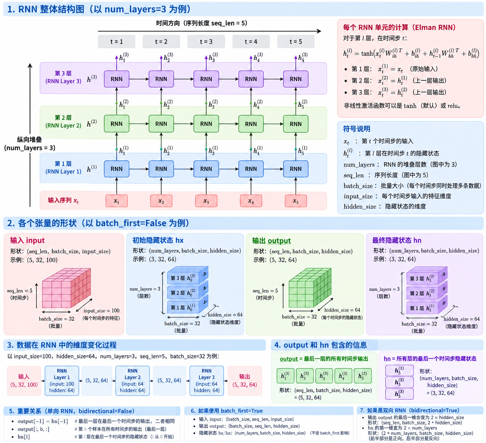

##  一、词嵌入
自然语言是由文字构成的，而语言的含义是由单词构成的。即单词是含义的最小单位。因此为了让计算机理解自然语言，首先要让它理解单词含义。
词向量是用于表示单词意义的向量，也可以看作词的特征向量。**将词映射到向量的技术称为** ***词嵌入（Word Embedding）***。

## 二 RNN （Recurrent Neural Network）
目前我们接触的神经网络都是前馈型神经网络。前馈（feedforward）是指网络的传播方向是单向的。具体地说，将输入信号传给下一层，下一层接收到信号后传给下下一层，然后再传给下下下一层…像这样，信号仅在一个方向上传播。虽然前馈网络结构简单、易于理解，并且可以应用于许多任务中。不过，这种网络存在一个大问题，就是不能很好地处理时间序列数据。更确切地说，单纯的前馈网络无法充分学习时序数据的性质。于是，循环神经网络（Recurrent Neural Network，RNN）应运而生。RNN层具有环路，通过环路数据可以在层内循环。向**时序数据** $x_0, x_1, \dots, x_t$ 输入层中，相应的会输出 $h_0, h_1, \dots, h_t$。



由图可知，各个时刻的 RNN 层接收传给该层的输入 $x_t$ 和前一个时刻 RNN 层的输出 $h_{t-1}$，据此计算当前时刻 RNN 层的输出 $h_t$：

$$
h_t = \tanh(h_{t-1} W_h + x_t W_x + b)
$$

**RNN 层有 2 个权重，分别是与输入 $x_t$ 运算的权重 $W_x$，和与前一时刻 RNN 层的输出 $h_{t-1}$（也叫隐藏状态、隐状态）运算的权重 $W_h$。执行完乘积和求和运算之后使用 $\tanh$ 函数转换，其结果就是时刻 $t$ 的输出 $h_t$。**

#### API使用

```python
torch.nn.RNN(
    input_size,              # ★ 输入特征维度
    hidden_size,             # ★ 隐藏状态 h 的维度
    num_layers=1,            # ★ RNN 堆叠层数
    nonlinearity="tanh",     # 激活函数："tanh" 或 "relu"
    bias=True,               # 是否使用偏置
    batch_first=False,       # ★ 输入是否采用 (batch, seq, feature)
    dropout=0.0,             # 多层 RNN 层之间的 Dropout
    bidirectional=False,     # ★ 是否使用双向 RNN
    device=None,             # 模型参数所在设备
    dtype=None               # 模型参数的数据类型
)
```

| 参数 | 作用 | 例如 |
|---|---|---|
| `input_size` ⭐ | **每个时间步输入的特征数量** | 词向量是 100 维 → `100` |
| `hidden_size` ⭐ | **隐藏状态 $h_t$ 的维度** | `128` 表示每个 $h_t$ 有 128 个特征 |
| `num_layers` ⭐ | **RNN 堆叠层数** | `2` 表示两层 RNN |
| `nonlinearity` | 激活函数 | `"tanh"` / `"relu"` |
| `bias` | 是否使用偏置 | 默认 `True` |
| `batch_first` ⭐ | 是否让 batch 维放最前面 | 通常建议 `True` |
| `dropout` | RNN 层之间的 Dropout | `0.2` |
| `bidirectional` ⭐ | 是否使用双向 RNN | `True` → 双向 |
| `device` | CPU / GPU | `"cuda"` |
| `dtype` | 参数数据类型 | `torch.float32` |

调用时候需要传递两个参数

```python
rnn = torch.nn.RNN(input_size, hidden_size, num_layers)

output, hn = rnn(input, hx)
# input:输入数据[seq_len序列长度, batch_size批量大小, input_size]
# hx:初始隐状态[num_layers, batch_size, hidden_size]
# output:输出数据[seq_len, batch_size, hidden_size]
# hn:隐状态[num_layers, batch_size, hidden_size]
```

