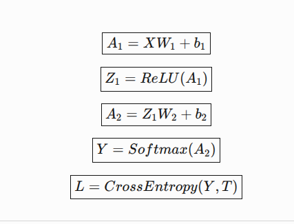
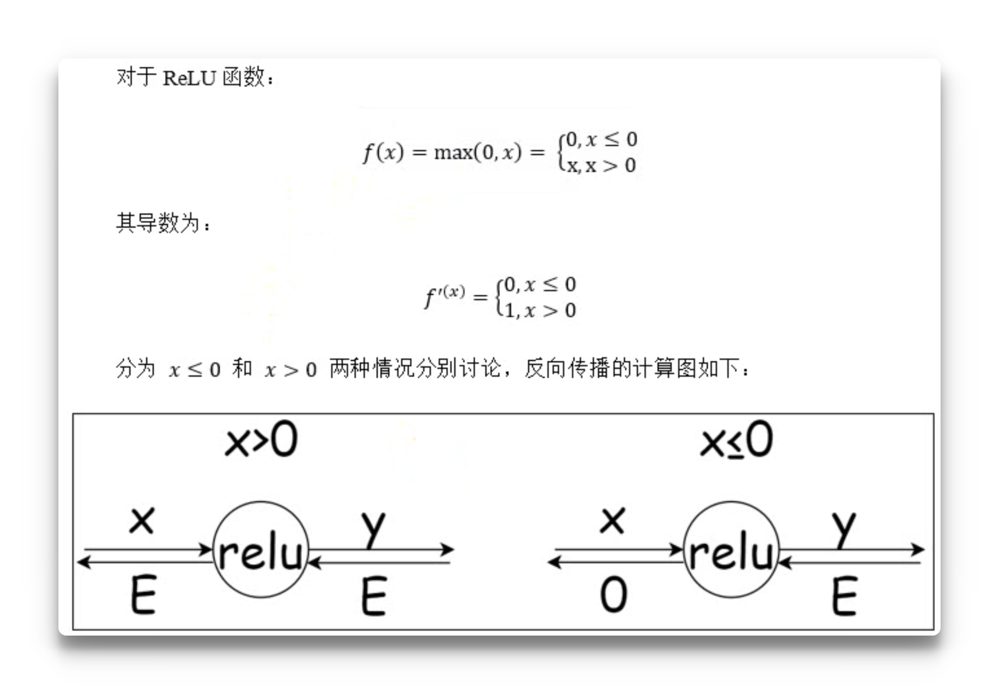
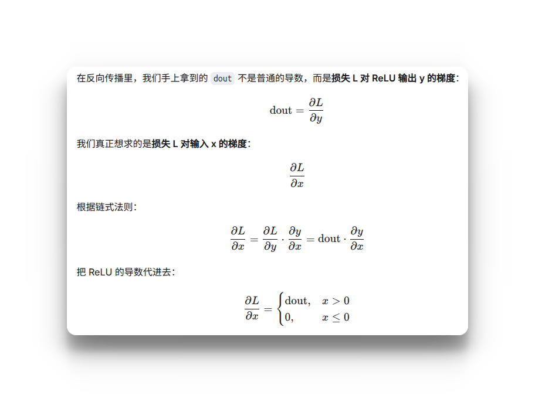
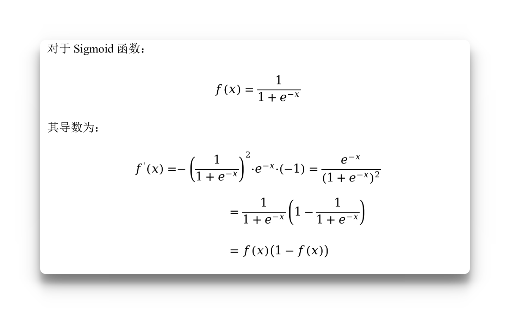
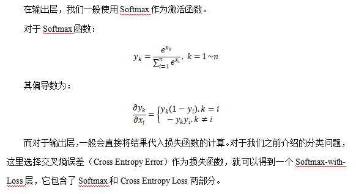
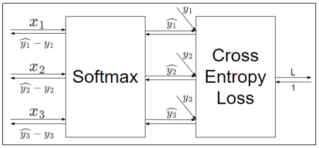
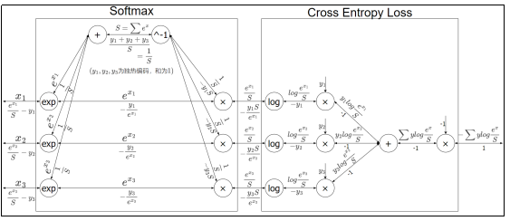

# 一 、反向传播
以数字识别为例


## 二、激活层的反向传播
### 2.1 Relu的反向传播

```python
import numpy as np


class ReLU:

    def __init__(self) -> None:
        # 用属性记录哪些输入小于0（布尔掩码）
        self.mask: np.ndarray | None = None

    def forward(self, x: np.ndarray) -> np.ndarray:
        # 记录输入 <= 0 的位置
        self.mask = (x <= 0)
        out = x.copy()
        # 大于0保留本身，小于等于0置为0
        out[self.mask] = 0
        return out

    def backward(self, dout: np.ndarray) -> np.ndarray:
        # dout 是从上一层传递过来的梯度
        dout[self.mask] = 0
        dx = dout.copy()
        return dx
```

### 2.2 Sigmoid 的反向传播

```python
class Sigmoid:

    def __init__(self) -> None:
        # 前向输出，初始为 None
        self.out: np.ndarray | None = None

    def forward(self, x: np.ndarray) -> np.ndarray:
        out = 1 / (1 + np.exp(-x))
        self.out = out
        return out

    def backward(self, dout: np.ndarray) -> np.ndarray:
        dx = dout * (1.0 - self.out) * self.out
        return dx
```

x不是参数x，而是输入到Sigmoid函数的向量/矩阵
### 2.3 Affine的反向传播和实现
在全连接层（Fully Connected Layer，Dense Layer）中，每个输入节点与输出节点相连，通过权重矩阵和偏置进行线性变换，这种操作在几何领域称为仿射变换（Affine transformation，几何中，仿射变换包括一次线性变换和一次平移，分别对应神经网络的加权求和运算与加偏置运算）。
考虑N个数据一起进行正向传播的情况，写成矩阵计算形式：
\[
Y = XW+B
\]
这里的X是形状为N×m的矩阵，m就是Affine层输入神经元的个数；而W是形状为m×n的权重矩阵，n就是Affine层输出神经元的个数。
根据矩阵求导的运算法则，可以得到损失函数L关于X、W的偏导数：
**对 $X$ 的梯度：**

$$
\frac{\partial L}{\partial X}
= \frac{\partial L}{\partial Y} \cdot \frac{\partial Y}{\partial X}
= \frac{\partial L}{\partial Y} \cdot W^T
$$

**对 $W$ 的梯度：**

$$
\frac{\partial L}{\partial W}
= X^T \cdot \frac{\partial L}{\partial Y}
$$
```python
class Affine:

    def __init__(self, W: np.ndarray, b: np.ndarray) -> None:
        """仿射层（Affine / 全连接层）：Y = XW + b

        Parameters
        ----------
        W : np.ndarray
            权重矩阵，形状 (D, M)。
        b : np.ndarray
            偏置向量，形状 (M,)。
        """
        self.W: np.ndarray = W
        self.b: np.ndarray = b

        # 保存输入的 x（已展平为二维）
        self.X: np.ndarray | None = None

        # 反向传播时计算的梯度
        self.dW: np.ndarray | None = None
        self.db: np.ndarray | None = None

        # 记录输入原始形状，考虑输入可能是三维甚至多维的情况
        self.original_x_shape: tuple[int, ...] | None = None

    def forward(self, x: np.ndarray) -> np.ndarray:
        """前向传播。

        Parameters
        ----------
        x : np.ndarray
            前一层的输出，形状任意（第一维为 batch 维）。

        Returns
        -------
        np.ndarray
            线性变换结果，形状 (N, M)。
        """
        self.original_x_shape = x.shape
        # 将输入展平为二维 (N, D) 再计算
        self.X = x.reshape(x.shape[0], -1)
        Y = np.dot(self.X, self.W) + self.b
        return Y

    def backward(self, dy: np.ndarray) -> np.ndarray:
        """反向传播。

        Parameters
        ----------
        dy : np.ndarray
            上游传来的梯度，形状 (N, M)。

        Returns
        -------
        np.ndarray
            对输入 x 的梯度，形状与 forward 的输入 x 相同。
        """
        # 对输入 x 的梯度：∂L/∂X = ∂L/∂Y · Wᵀ
        dx = np.dot(dy, self.W.T)

        # 对权重 W 的梯度：∂L/∂W = Xᵀ · ∂L/∂Y
        self.dW = self.X.T @ dy

        # 对偏置 b 的梯度：∂L/∂b = Σ_i ∂L/∂Y_i
        #
        # 前向时 b 被广播到了 N 个样本上，每个样本都对 b 有贡献；
        # 反向时按链式法则，b 的梯度就是这 N 份贡献的累加，
        # 所以要对 dy 沿样本维（axis=0）求和，
        # 得到与 b 同形状的 (M,) 向量。
        self.db = np.sum(dy, axis=0)

        # 解包恢复原来的维度
        return dx.reshape(*self.original_x_shape)
```
### 2.4 Softmax 的反向传播极其实现



这是经过softmax函数和交叉熵损失函数的示意图
```
Z2
 ↓
Softmax
 ↓
y
 ↓
Cross Entropy
 ↓
Loss (L)
```
我们这里实际上要求的是
$$
\frac{\partial L}{\partial Z2}
$$
​
神奇的地方就在于：
$$
\frac{\partial L}{\partial Z_2} = \frac{y - t}{B}
$$
其中 t 必须是 One-Hot：
>  y = [0.1, 0.7, 0.2]
t = [0,   1,   0]
这里的B就是batch_size

**推导过程：**
这是 Softmax + Cross Entropy 最经典的结论：

$$
L = -\sum_j t_j \log y_j
$$

Softmax：

$$
y_j = \frac{e^{z_j}}{\sum_k e^{z_k}}
$$

把 Softmax 代入交叉熵：

$$
L = -\sum_j t_j \log \frac{e^{z_j}}{\sum_k e^{z_k}}
$$

展开：

$$
L = -\sum_j t_j z_j + \log \sum_k e^{z_k}
$$

对 $z_j$ 求导：

$$
\frac{\partial L}{\partial z_j} = -t_j + \frac{e^{z_j}}{\sum_k e^{z_k}}
$$

而后面这一项正好就是：

$$
y_j
$$

所以：

$$
\boxed{\frac{\partial L}{\partial z_j} = y_j - t_j}
$$

如果你的 Loss 是 batch 平均：

$$
\boxed{D_2 = \frac{y - t}{B}}
$$

这就是你之前看到的 **为什么 $D_2 = Y - T$ 的来源**。

如果t不是独热编码怎么办？那也很简单，那么此时就把t当成下标不就行了，比如t=[1,0,2],那么，t作为下标在y中的取值不就是正确标签对应的概率嘛
``` 
                 t 是类别下标
                       |
                       ↓
                   [1, 0, 2]
                       |
                       ↓
                 相当于 One-Hot
                       |
                       ↓
Y — Softmax —> Y — Cross Entropy —> L
↑
|___ 反向传播
     |
     ↓
dZ = (Y - T) / B
```
代码实现：
```python
class SoftmaxWithLoss:
    @staticmethod
    def softmax(x: np.ndarray):  # 这里的x是二维数组
        x = x - np.max(x, axis=1, keepdims=True)
        exp_x = np.exp(x)
        y = exp_x / np.sum(exp_x, axis=1, keepdims=True)
        return y

    @staticmethod
    def cross_entropy_error(y: np.ndarray, t: np.ndarray):

        if y.ndim == 1:  # 如果是输入一个样本，那么还是将其转化为二维矩阵
            y = y.reshape(1, y.size)
            t = t.reshape(1, t.size)
        if t.size == y.size:  # 也就是说经过了独热编码
            # 转换
            t = t.argmax(axis=1)  # 返回的是最大值所在的索引（下标）
        batch_size = t.shape[0]
        loss_sum = -np.sum(np.log(y[np.arange(batch_size), t] + 1e-7))
        return loss_sum / batch_size

    def __init__(self):
        self.loss = None
        self.y = None  # 这是softmax的输出
        self.t = None  ##这是正确的标签，这里采用独热编码

    def forward(
        self,
        x: np.ndarray,
        t: np.ndarray,
    ):
        self.t = t
        self.y = __class__.softmax(x)
        self.loss = __class__.cross_entropy_error(self.y, t)
        return self.loss

    def backward(
        self,
        dout=1.0,  # 这个dout 是上一层传递过来的梯度，但是我们这里是把SoftmaxWithLoss作为一个整体，所以上一层传递过来的梯度就是DL/DL = 1
    ):
        batch_size = self.t.shape[0]
        if self.t.size == self.y.size:
            # t 是One-hot
            dx = (self.y - self.t) / batch_size
        else:
            # t如果是类别下标,这里其实就是巧妙的将类别下标转化为了One-hot,直接用类别作为下标去取y中的值，对应的就是正确标签;
            # 如果是独热编码，那么t这个位置的值就是1,  所以这里才会减去1。非常巧妙
            dx = self.y.copy()
            dx[np.arange(batch_size), self.t] -= 1
            dx = dx / batch_size
        return dx
```
# 三、神经网络的训练优化
