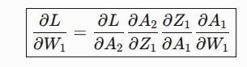
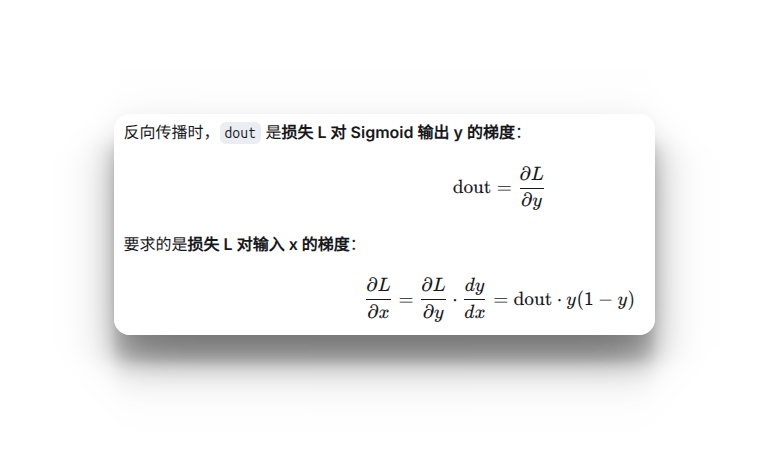

以数字识别为例


## 二、激活层的反向传播
### 2.1 Relu的反向传播

```python
import numpy as np


class ReLU:

    def __init__(self) -> None:
        # 用属性记录哪些输入小于0（布尔掩码）
        self.mask: np.ndarray | None = None

    def forward(self, x: np.ndarray) -> np.ndarray:
        # 记录输入 <= 0 的位置
        self.mask = (x <= 0)
        out = x.copy()
        # 大于0保留本身，小于等于0置为0
        out[self.mask] = 0
        return out

    def backward(self, dout: np.ndarray) -> np.ndarray:
        # dout 是从上一层传递过来的梯度
        dout[self.mask] = 0
        dx = dout.copy()
        return dx
```

### 2.2 Sigmoid 的反向传播

```python
class Sigmoid:

    def __init__(self) -> None:
        # 前向输出，初始为 None
        self.out: np.ndarray | None = None

    def forward(self, x: np.ndarray) -> np.ndarray:
        out = 1 / (1 + np.exp(-x))
        self.out = out
        return out

    def backward(self, dout: np.ndarray) -> np.ndarray:
        dx = dout * (1.0 - self.out) * self.out
        return dx
```

x不是参数x，而是输入到Sigmoid函数的向量/矩阵
### 2.3 Affine的反向传播和实现
在全连接层（Fully Connected Layer，Dense Layer）中，每个输入节点与输出节点相连，通过权重矩阵和偏置进行线性变换，这种操作在几何领域称为仿射变换（Affine transformation，几何中，仿射变换包括一次线性变换和一次平移，分别对应神经网络的加权求和运算与加偏置运算）。
考虑N个数据一起进行正向传播的情况，写成矩阵计算形式：
\[
Y = XW+B
\]
这里的X是形状为N×m的矩阵，m就是Affine层输入神经元的个数；而W是形状为m×n的权重矩阵，n就是Affine层输出神经元的个数。
根据矩阵求导的运算法则，可以得到损失函数L关于X、W的偏导数：
**对 $X$ 的梯度：**

$$
\frac{\partial L}{\partial X}
= \frac{\partial L}{\partial Y} \cdot \frac{\partial Y}{\partial X}
= \frac{\partial L}{\partial Y} \cdot W^T
$$

**对 $W$ 的梯度：**

$$
\frac{\partial L}{\partial W}
= X^T \cdot \frac{\partial L}{\partial Y}
$$
```python
class Affine:

    def __init__(self, W: np.ndarray, b: np.ndarray) -> None:
        """仿射层（Affine / 全连接层）：Y = XW + b

        Parameters
        ----------
        W : np.ndarray
            权重矩阵，形状 (D, M)。
        b : np.ndarray
            偏置向量，形状 (M,)。
        """
        self.W: np.ndarray = W
        self.b: np.ndarray = b

        # 保存输入的 x（已展平为二维）
        self.X: np.ndarray | None = None

        # 反向传播时计算的梯度
        self.dW: np.ndarray | None = None
        self.db: np.ndarray | None = None

        # 记录输入原始形状，考虑输入可能是三维甚至多维的情况
        self.original_x_shape: tuple[int, ...] | None = None

    def forward(self, x: np.ndarray) -> np.ndarray:
        """前向传播。

        Parameters
        ----------
        x : np.ndarray
            前一层的输出，形状任意（第一维为 batch 维）。

        Returns
        -------
        np.ndarray
            线性变换结果，形状 (N, M)。
        """
        self.original_x_shape = x.shape
        # 将输入展平为二维 (N, D) 再计算
        self.X = x.reshape(x.shape[0], -1)
        Y = np.dot(self.X, self.W) + self.b
        return Y

    def backward(self, dy: np.ndarray) -> np.ndarray:
        """反向传播。

        Parameters
        ----------
        dy : np.ndarray
            上游传来的梯度，形状 (N, M)。

        Returns
        -------
        np.ndarray
            对输入 x 的梯度，形状与 forward 的输入 x 相同。
        """
        # 对输入 x 的梯度：∂L/∂X = ∂L/∂Y · Wᵀ
        dx = np.dot(dy, self.W.T)

        # 对权重 W 的梯度：∂L/∂W = Xᵀ · ∂L/∂Y
        self.dW = self.X.T @ dy

        # 对偏置 b 的梯度：∂L/∂b = Σ_i ∂L/∂Y_i
        #
        # 前向时 b 被广播到了 N 个样本上，每个样本都对 b 有贡献；
        # 反向时按链式法则，b 的梯度就是这 N 份贡献的累加，
        # 所以要对 dy 沿样本维（axis=0）求和，
        # 得到与 b 同形状的 (M,) 向量。
        self.db = np.sum(dy, axis=0)

        # 解包恢复原来的维度
        return dx.reshape(*self.original_x_shape)
```