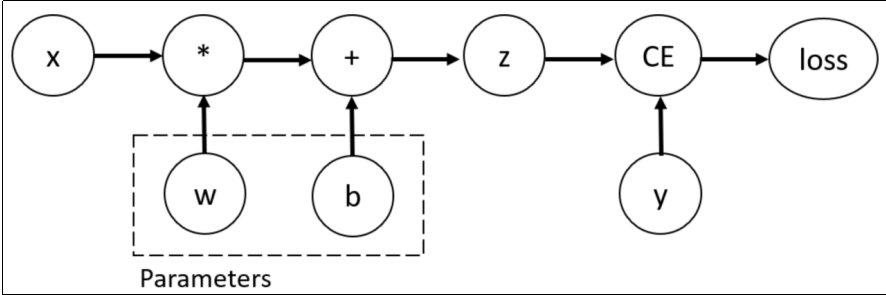

# Pytorch
Tensor（张量）是PyTorch的核心数据结构。张量在不同学科中有不同的意义，在深度学习中张量表示一个多维数组，是标量、向量、矩阵的拓展。如一个RGB图像的数组就是一个三维张量，第1维是图像的高，第2维是图像的宽，第3维是图像的颜色通道。

## 一、Pytorch自动微分模块
训练神经网络时，框架会根据设计好的模型构建一个计算图（computational graph），来跟踪计算是哪些数据通过哪些操作组合起来产生输出，并通过反向传播算法来根据给定参数的损失函数的梯度调整参数（模型权重）。
PyTorch具有一个内置的微分引擎torch.autograd以支持计算图的梯度自动计算。
考虑最简单的单层神经网络，具有输入x、参数w、偏置b以及损失函数：


该计算图中x、w、b为叶子节点，即最基础的节点。叶子节点的数据并非由计算生成，因此是整个计算图的基石，叶子节点张量不可以执行in-place操作。而最终的loss为根节点。
可通过is_leaf属性查看张量是否为叶子节点：
```python
import torch
# 输入值
x = torch.Tensor([[10.0]])
# 输出值
y = torch.Tensor([[3.0]])

#初始化权重
w = torch.rand(1,1,requires_grad=True)
#初始化偏置
b = torch.rand(1,1,requires_grad=True)
print(f"w = {w}, b = {b}")
# 前向传播
z = w * x + b
print(f"z == {z}")
def mse(y:torch.Tensor ,z:torch.Tensor):
    return (y - z).pow(2)
loss= torch.nn.MSELoss()
print(f"mse(y,z) = {mse(y,z)}")
print(f"loss(y,z) = {loss(y,z)}")
print(f"loss(y,z) = {loss(y,z)}")
loss_value = loss(z,y)
loss_value.backward()
print(f"w_data = {w.data} ; b_data = {b.data}")
print(f"w_grad_fn = {w.grad_fn} ; b_grad_fn= {b.grad_fn}")
print(f"w_grad = {w.grad} ; b_grad = {b.grad}")
```
自动微分的关键就是记录节点的数据与运算。数据记录在张量的data属性(也就是当前参数本身的值）中，计算记录在张量的grad_fn属性中。计算图根据搭建方式可分为静态图和动态图，PyTorch是动态图机制，在计算的过程中逐步搭建计算图，同时对每个Tensor都存储grad_fn供自动微分使用。
若设置张量参数requires_grad=True，则PyTorch会追踪所有基于该张量的操作，并在反向传播时计算其梯度。依赖于叶子节点的节点，requires_grad默认为True。当计算到根节点后，在根节点调用backward()方法即可反向传播计算计算图中所有节点的梯度。
**非叶子节点的梯度在反向传播之后会被释放掉（除非设置参数retain_grad=True）**。**而叶子节点的梯度在反向传播之后会保留（累积）。** 通常需要使用optimizer.zero_grad()清零参数的梯度。

**提问**：为什么需要调用optimizer.zero_grad()清零参数的梯度。使用场景是什么？
optimizer.zero_grad() 是为了解决梯度累加的问题，因为pytorch的梯度默认是“累加”而不是“覆盖”，pytorch做的事情是w.grad←w.grad+当前计算出的梯度，所以真正在训练的时候，所以每训练一个 batch，通常都要先把上一个 batch 留下来的梯度清掉。
```python
for x, y in dataloader:
    # 1. 清除上一轮梯度
    optimizer.zero_grad()
    # 2. 前向传播
    y_pred = model(x)
    # 3. 计算损失
    loss = criterion(y_pred, y)
    # 4. 反向传播
    loss.backward()
    # 5. 更新参数
    optimizer.step()
```

**提问** :既然这样，那么为什么pytorch不直接自动清零？
因为梯度累加本来是一个非常有用的功能，比如我当前的GPU显存一次只能放32个样本，但是我想模拟 `batch_size = 128` 的场景，那么此时就可以连续算4个batch，等这四个batch算完之后再将梯度清零，然后统一更新参数
```python
optimizer.zero_grad()
for i in range(4):
    loss = model(x[i])
    loss.backward()      # 梯度不断累加

optimizer.step()
```
> 此时 `grad=grad1​+grad2​+grad3​+grad4​`,然后统一更新一次参数。这就是梯度累积（Gradient Accumulation），训练大模型时尤其常见。

**`tensor.detach()` :** 有时我们希望将某些计算移动到计算图之外，可以使用Tensor.detach()返回一个新的变量，该变量与原变量具有相同的值，但丢失计算图中如何计算原变量的信息。换句话说，梯度不会在该变量处继续向下传播。**得到一个与原 Tensor 共享数据，但脱离当前计算图、不再参与反向传播的 Tensor**
**提问： detach()的使用场景是什么？**
 - 最常见的使用场景：拿模型输出做后处理。比如拿模型的某个节点的输出取做后处理，我需要这个节点的结果，但是我又不希望这个节点去影响我的模型的训练，此时就可以将这个节点detach掉。
 - 另一个非常重要的场景是：**主动阻断某一部分的梯度传播。**
  实际深度学习中很常见，例如：
  ```python
   features = encoder(x)
    features = features.detach()
    output = classifier(features)
 ```
> 这相当于告诉 PyTorch：
> classifier 可以继续计算，但不要通过 classifier 的损失去训练前面的 encoder。
> 这种思路会出现在冻结某部分网络、Teacher-Student、GAN、目标网络等场景中。

```python
X = torch.full((2, 2), 2.0, requires_grad=True)
Y = X * X

U = Y.detach() #detach之后，就相当于把Y当成常数了 ，所以Dz/dx = U = X^2 = 4
Z = U * X

target = Z.sum()
# 计算target对X的梯度
target.backward()
print(X.grad, X.grad_fn)
```
> detach() 之后只是把tensor移出当前计算图，但是当前数据还是共享的，也就是U和Y不是同一个对象但是它们底层公用一个数据

```python
print(id(U))
print(id(Y))
print(id(U.data))
print(id(Y.data))
print(id(U.untyped_storage().data_ptr))
print(id(Y.untyped_storage().data_ptr)) 
```
> 1335630432928
> 1335635651840
> 1335635608032
> 1335635608032
> 1335635608016
> 1335635613216
