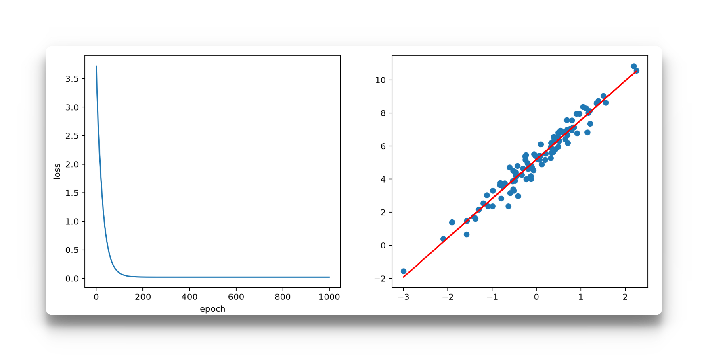
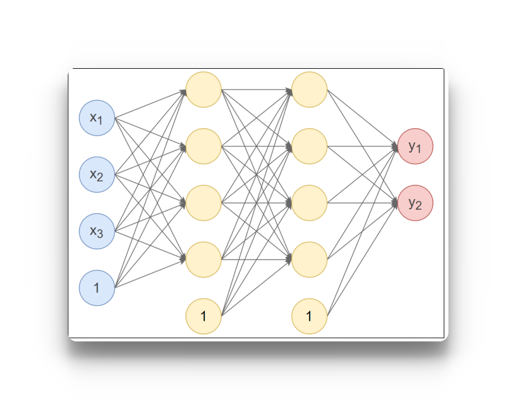

# Pytorch
Tensor（张量）是PyTorch的核心数据结构。张量在不同学科中有不同的意义，在深度学习中张量表示一个多维数组，是标量、向量、矩阵的拓展。如一个RGB图像的数组就是一个三维张量，第1维是图像的高，第2维是图像的宽，第3维是图像的颜色通道。

## 一、Pytorch自动微分模块
训练神经网络时，框架会根据设计好的模型构建一个计算图（computational graph），来跟踪计算是哪些数据通过哪些操作组合起来产生输出，并通过反向传播算法来根据给定参数的损失函数的梯度调整参数（模型权重）。
PyTorch具有一个内置的微分引擎torch.autograd以支持计算图的梯度自动计算。
考虑最简单的单层神经网络，具有输入x、参数w、偏置b以及损失函数：


该计算图中x、w、b为叶子节点，即最基础的节点。叶子节点的数据并非由计算生成，因此是整个计算图的基石，叶子节点张量不可以执行in-place操作。而最终的loss为根节点。
可通过is_leaf属性查看张量是否为叶子节点：
```python
import torch
# 输入值
x = torch.Tensor([[10.0]])
# 输出值
y = torch.Tensor([[3.0]])

#初始化权重
w = torch.rand(1,1,requires_grad=True)
#初始化偏置
b = torch.rand(1,1,requires_grad=True)
print(f"w = {w}, b = {b}")
# 前向传播
z = w * x + b
print(f"z == {z}")
def mse(y:torch.Tensor ,z:torch.Tensor):
    return (y - z).pow(2)
loss= torch.nn.MSELoss()
print(f"mse(y,z) = {mse(y,z)}")
print(f"loss(y,z) = {loss(y,z)}")
print(f"loss(y,z) = {loss(y,z)}")
loss_value = loss(z,y)
loss_value.backward()
print(f"w_data = {w.data} ; b_data = {b.data}")
print(f"w_grad_fn = {w.grad_fn} ; b_grad_fn= {b.grad_fn}")
print(f"w_grad = {w.grad} ; b_grad = {b.grad}")
```
自动微分的关键就是记录节点的数据与运算。数据记录在张量的data属性(也就是当前参数本身的值）中，计算记录在张量的grad_fn属性中。计算图根据搭建方式可分为静态图和动态图，PyTorch是动态图机制，在计算的过程中逐步搭建计算图，同时对每个Tensor都存储grad_fn供自动微分使用。
若设置张量参数requires_grad=True，则PyTorch会追踪所有基于该张量的操作，并在反向传播时计算其梯度。依赖于叶子节点的节点，requires_grad默认为True。当计算到根节点后，在根节点调用backward()方法即可反向传播计算计算图中所有节点的梯度。
**非叶子节点的梯度在反向传播之后会被释放掉（除非设置参数retain_grad=True）**。**而叶子节点的梯度在反向传播之后会保留（累积）。** 通常需要使用optimizer.zero_grad()清零参数的梯度。

**提问**：为什么需要调用optimizer.zero_grad()清零参数的梯度。使用场景是什么？
optimizer.zero_grad() 是为了解决梯度累加的问题，因为pytorch的梯度默认是“累加”而不是“覆盖”，pytorch做的事情是w.grad←w.grad+当前计算出的梯度，所以真正在训练的时候，所以每训练一个 batch，通常都要先把上一个 batch 留下来的梯度清掉。
```python
for x, y in dataloader:
    # 1. 清除上一轮梯度
    optimizer.zero_grad()
    # 2. 前向传播
    y_pred = model(x)
    # 3. 计算损失
    loss = criterion(y_pred, y)
    # 4. 反向传播
    loss.backward()
    # 5. 更新参数
    optimizer.step()
```

**提问** :既然这样，那么为什么pytorch不直接自动清零？
因为梯度累加本来是一个非常有用的功能，比如我当前的GPU显存一次只能放32个样本，但是我想模拟 `batch_size = 128` 的场景，那么此时就可以连续算4个batch，等这四个batch算完之后再将梯度清零，然后统一更新参数
```python
optimizer.zero_grad()
for i in range(4):
    loss = model(x[i])
    loss.backward()      # 梯度不断累加

optimizer.step()
```
> 此时 `grad=grad1​+grad2​+grad3​+grad4​`,然后统一更新一次参数。这就是梯度累积（Gradient Accumulation），训练大模型时尤其常见。

**`tensor.detach()` :** 有时我们希望将某些计算移动到计算图之外，可以使用Tensor.detach()返回一个新的变量，该变量与原变量具有相同的值，但丢失计算图中如何计算原变量的信息。换句话说，梯度不会在该变量处继续向下传播。**得到一个与原 Tensor 共享数据，但脱离当前计算图、不再参与反向传播的 Tensor**
**提问： detach()的使用场景是什么？**
 - 最常见的使用场景：拿模型输出做后处理。比如拿模型的某个节点的输出取做后处理，我需要这个节点的结果，但是我又不希望这个节点去影响我的模型的训练，此时就可以将这个节点detach掉。
 - 另一个非常重要的场景是：**主动阻断某一部分的梯度传播。**
  实际深度学习中很常见，例如：
  ```python
   features = encoder(x)
    features = features.detach()
    output = classifier(features)
 ```
> 这相当于告诉 PyTorch：
> classifier 可以继续计算，但不要通过 classifier 的损失去训练前面的 encoder。
> 这种思路会出现在冻结某部分网络、Teacher-Student、GAN、目标网络等场景中。

```python
import torch
import matplotlib.pyplot as plt
from torch import nn, optim
from torch.utils.data import TensorDataset,DataLoader
"""
通过PyTorch训练一个模型一般分为以下4个步骤：
准备数据 → 构建模型 → 定义损失函数与优化器 → 模型训练
"""
#构建数据集
X = torch.randn(100,1)
w = torch.tensor(2.5)
b = torch.tensor(5.2)
noise = torch.randn(100,1) * 0.5

# 目标函数
y = w * X + b + noise # 现在我们要通过线性回归来拟合这个函数，看看我的们拟合的和真实的参数的差距
dataset = TensorDataset(X,y)
dataloader = DataLoader(
    dataset=dataset,batch_size=10,shuffle=True # shuffle为是否打乱数据
)

# 2. 构建模型，选择torch中的线性模型
model = nn.Linear(in_features=1, out_features=1) #线性回归模型，输入一个特征，输出一个特征

# 3. 定义损失函数和优化器
loss = nn.MSELoss() # 均方误差为损失函数
optmizer = optim.SGD(model.parameters(), lr=0.001) #定义随机梯度下降

# 4. 训练模型
loss_lst = []
for epoch in range(1000):
    total_loss = 0 #每个epoch的损失
    train_num = 0 # 这里记录总的训练次数，也就是总共训练了多少个样本
    for x_train, y_train in dataloader: ##这里拿出来的是一个bach_size大小的元组列表
        # 这个x_train和y_train是一个batch大小的数据
        #  4.1 模型预测，前向传播
        y_pred = model(x_train)
        # 4.2 计算损失
        current_loss = loss(y_pred,y_train)
        train_num += len(x_train)
        total_loss += current_loss.item()
        # 4.3 梯度清零，清除上一个batch的历史梯度
        optmizer.zero_grad()
        # 4.5 反向传播计算当前batch梯度
        current_loss.backward()
        # 4.6 根据梯度更新参数
        optmizer.step()
    loss_lst.append(total_loss / train_num)
print(f"权重 ： {model.weight}, 偏置： {model.bias}") # 打印权重和偏置
fig ,ax = plt.subplots(nrows=1, ncols=2,figsize = (12,5))
ax[0].plot(loss_lst)
ax[0].set_xlabel("epoch")
ax[0].set_ylabel("loss")
ax[1].scatter(X,y)
y_pred = model.forward(X).detach().squeeze().numpy()
ax[1].plot(X,y_pred,color = 'r')
plt.show()

```


## 二、pytorch进行深度学习

### 2.1 激活函数
#### 2.1.1 Sigmoid()
#### 2.1.2 Tanh()
#### 2.1.3 ReLU()
#### 2.1.4 Softmax()
### 2.2 参数初始化和正则化
#### 2.2.1 全连接层
在神经网络中，参数主要位于全连接层（仿射层Affine）中。
PyTorch提供了torch.nn模块，专门用于神经网络的构建和训练。其中全连接层被实现为Linear类，内部有两个属性：权重 weight和偏置bias；这就是神经网络的主要参数。
```python
import torch.nn as nn

linear = nn.Linear(5, 2)
```
**上面代码定义了一个有5个输入神经元、2个输出神经元的全连接层。**
- 常数初始化
- 秩初始化
- 正态分布初始化
- Xavier初始化
- He初始化
#### 2.2.2 Dropout随机失活
Dropout（随机失活，暂退法）是一种在学习过程中随机关闭部分神经元的方法。可以通过 `torch.nn.Dropout(p)` 使用 Dropout，并通过参数 `p` 设置神经元的失活概率。训练过程中，每个神经元都有 `p` 的概率被置为 `0`，而保留下来的神经元输出会被放大为原来的：

$$
\frac{1}{1-p}
$$

倍，**以保证 Dropout 前后输出的数学期望基本不变**。例如 `p=0.5` 时，约 50% 的神经元会被随机关闭，剩余神经元的输出会放大为原来的 2 倍。

Dropout 可以防止模型过度依赖某些特定神经元，迫使不同神经元学习更加独立、有效的特征，从而**减少过拟合，提高模型的泛化能力**。

> **注意：** Dropout 只在训练阶段生效；调用 `model.eval()` 进入推理模式后，Dropout 会被关闭，所有神经元正常参与计算。

#### 2.2.3 权值衰减
权值衰减（Weight Decay）是一种通过**限制模型权重过大**来减少过拟合的正则化方法。

在训练过程中，会在原来的损失函数后面增加一个与权重大小有关的惩罚项，例如常见的 L2 正则化：

$$
L_{new}=L+\frac{\lambda}{2}\sum_i w_i^2
$$

其中，\(\lambda\) 表示权值衰减的强度。权重 \(w\) 越大，产生的惩罚就越大，因此模型在训练时会倾向于使用较小的权重。

从梯度下降的角度来看：

$$
w \leftarrow w-\eta\left(\frac{\partial L}{\partial w}+\lambda w\right)
$$

整理后：

$$
\boxed{
w \leftarrow (1-\eta\lambda)w-\eta\frac{\partial L}{\partial w}
}
$$

可以看到，每次更新参数时，权重都会先乘上一个略小于 1 的系数：

$$
(1-\eta\lambda)
$$

因此权重会不断受到一个**向 0 衰减的作用**，这也是“权值衰减”这个名字的来源。

在 PyTorch 中，可以通过优化器的 `weight_decay` 参数设置：

```python
optimizer = torch.optim.SGD(
    model.parameters(),
    lr=0.01,
    weight_decay=1e-4
)
```

权值衰减可以防止某些权重变得过大，降低模型对训练数据中特定特征的过度依赖，从而**减少过拟合，提高模型的泛化能力**。

> **核心理解：** Dropout 是通过“随机关闭部分神经元”来降低过拟合，而权值衰减是通过“限制权重不要变得过大”来降低过拟合。
#### 2.3.4 批量标准化
批量标准化（Batch Normalization，BatchNorm）是一种对神经网络中间层的数据进行**标准化处理**的方法，可以让数据分布更加稳定，从而使模型训练更加稳定、收敛更快。

训练过程中，BatchNorm 会针对一个 Mini-Batch 的数据，首先计算均值和方差：

$$
\mu_B=\frac{1}{m}\sum_{i=1}^{m}x_i
$$

$$
\sigma_B^2=\frac{1}{m}\sum_{i=1}^{m}(x_i-\mu_B)^2
$$

然后对数据进行标准化：

$$
\hat{x}_i=
\frac{x_i-\mu_B}
{\sqrt{\sigma_B^2+\epsilon}}
$$

经过标准化后，数据大致变成：

$$
均值\approx0,\qquad 方差\approx1
$$

但是，如果强制所有数据都保持这种分布，可能会限制神经网络的表达能力。因此 BatchNorm 又引入了两个**可以学习的参数**：

$$
\boxed{
y_i=\gamma\hat{x}_i+\beta
}
$$

其中：

* \(\gamma\)：控制数据的缩放程度
* \(\beta\)：控制数据的平移程度

这两个参数会和神经网络中的权重一样，通过反向传播自动学习。

对于全连接层，可以使用：

```python
nn.BatchNorm1d(128)
```

例如：

```python
model = nn.Sequential(
    nn.Linear(784, 128),
    nn.BatchNorm1d(128),
    nn.ReLU(),
    nn.Linear(128, 10)
)
```

整体过程可以理解为：

```text
Linear
   ↓
得到一批神经元输出
   ↓
BatchNorm
   ↓
减均值、除标准差
   ↓
均值≈0，方差≈1
   ↓
γ × x + β
   ↓
ReLU
```

BatchNorm 可以让不同批次的数据分布更加稳定，减少训练过程中数值分布发生剧烈变化的问题，通常能够让模型**训练更加稳定、允许使用较大的学习率，并加快模型收敛**。

> **核心理解：** BatchNorm 就是先把一个 Mini-Batch 中的数据进行标准化，再通过可学习的 \(\gamma\) 和 \(\beta\) 对数据进行缩放和平移，让神经网络自己决定最合适的数据分布。

**总结：**
**Dropout**：一种正则化方法，通过随机关闭部分神经元，减少过拟合；通常作为网络中的独立层使用。
**权值衰减（Weight Decay）**：一种正则化方法，通过限制权重过大来降低模型复杂度；它不是网络层，通常配置在优化器中。
**批量标准化（BatchNorm）**：主要用于稳定数据分布、加速收敛，虽然具有一定的正则化效果，但主要目的不是正则化；通常作为网络中的独立层使用。

因此，三者都可能改善模型的泛化能力，但 Dropout 和权值衰减属于典型正则化方法，而 BatchNorm 主要是一种训练稳定化方法。

### 2.3 pytorch构建神经网络
#### 2.3.1自定义模型
在神经网络框架中，由多个层组成的组件称之为 模块（Module）。
在PyTorch中模型就是一个Module，各网络层、模块也是Module。Module是所有神经网络的基类。
在定义一个Module时，我们需要继承torch.nn.Module并主要实现两个方法：
__init__：定义网络各层的结构，并初始化参数。
forward：根据输入进行前向传播，并返回输出。计算其输出关于输入的梯度，可通过其反向传播函数进行访问（通常自动发生）。forward方法是每次调用的具体实现。
接下来使用PyTorch实现下图的神经网络：

第1个隐藏层：使用Xavier正态分布初始化权重，激活函数使用Tanh。
第2个隐藏层：使用He正态分布初始化权重，激活函数使用ReLU。
输出层：按默认方式初始化，激活函数使用Softmax。

```python
import torch
import torch.nn as nn

class Model(nn.Module):
    def __init__(self, *args, **kwargs):
        super().__init__(*args, **kwargs)
        # 第一层3个输入四个输出的全连接层
        self.linear1 = nn.Linear(3,4)
        nn.init.xavier_normal_(self.linear1.weight)
        self.linear2 = nn.Linear(4,4)
        nn.init.kaiming_normal_(self.linear2.weight)
        self.out = nn.Linear(4,2) # 默认使用He均匀分布初始化

    def forward(self,x):
        x = self.linear1(x)
        x = torch.tanh(x)
        x = self.linear2(x)
        x = torch.relu(x)
        x = self.out(x)
        x = torch.softmax(x, dim=1)
        return x

model = Model()
output = model(torch.randn(10, 3))

print("输出：\n", output)
print()
# 使用named_parameters()查看各层参数
print("模型参数：")
for name, param in model.named_parameters():
    print(name, param)
    print()
# 使用state_dict()查看各层参数
print("模型参数：\n", model.state_dict())
```
