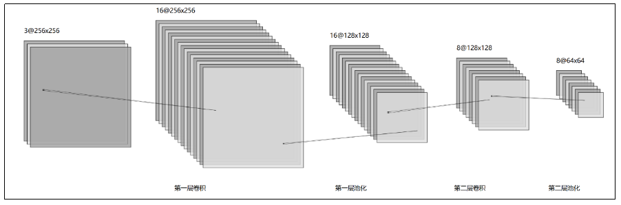
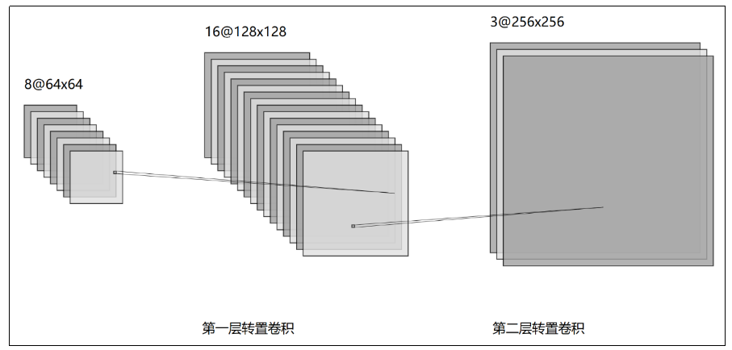
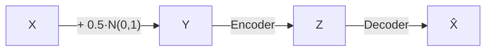

# 一、架构设计
## 1.1、编码器架构设计

## 1.2 解码器结构设计

## 1.3 实现原理

这其实就是一个完整的：
它非常适合帮助你理解：
**卷积 → 下采样 → 特征压缩 → 上采样 → 图像重建 → 去噪**
但是如果目标变成真正部署到实际照片上，那么关键就不再只是把网络加深，而是：

$$
\boxed{\text{训练时的噪声分布} \approx \text{实际使用时的噪声分布}}
$$

这一点甚至可能比单纯增加模型复杂度更加重要。
所以你可以把人为加噪声理解成：
我们不是认为真实世界的噪声就是 torch.randn()，而是人为构造一个“出题器”，不断制造「损坏图片 → 正确图片」训练题给模型做。真实应用中，这个出题器必须尽可能模拟实际图像的退化过程。

# 二、代码清单
- denoising_data.py：数据处理
- denoising_engine.py：训练、验证和测试的基本实现
- denoising_model.py：模型定义
- denoising_train.py：包括数据加载、预处理直至训练的完整流程
