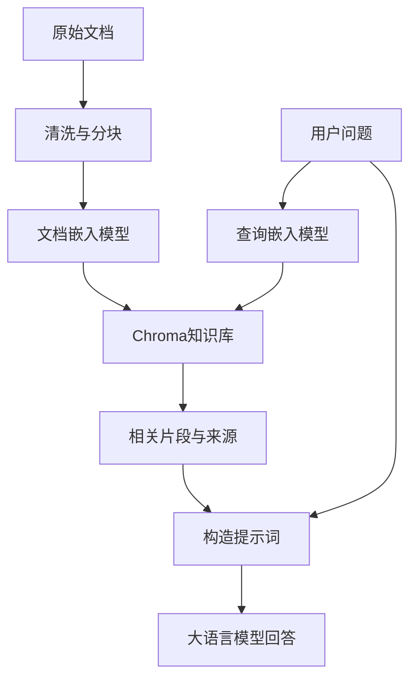

# Chroma 原理与使用指南

> 面向 Python 初学者，介绍向量数据库原理与实际操作。接口依据 2026-10-09 查阅的 Chroma 官方文档；不同版本可能有差异。代码以当前单机 Python API 为主。本文示例已检查语法，未在真实 Chroma 环境中执行；模型首次使用可能需要联网下载。

## 1. Chroma 是什么

Chroma 是用于存储和检索嵌入向量（Embedding）的数据库，常用于语义搜索、知识库和检索增强生成（RAG）。

普通数据库适合查询“编号等于多少”“金额大于多少”；向量数据库擅长查询“哪些内容和这句话的意思接近”。例如，“怎样恢复登录密码”与“忘记密码后的重置步骤”没有完全相同的措辞，但嵌入模型可能把它们映射到相近的位置。

Chroma 负责向量存储、索引、过滤和检索。**文本的语义表达由嵌入模型产生，答案生成由大语言模型完成。** Chroma 可以调用嵌入函数，但它本身不会训练出一个理解业务的语言模型。

| 概念 | 含义 | 示例 |
| --- | --- | --- |
| Client | 访问数据库的客户端 | 内存、本地持久化、HTTP 客户端 |
| Collection | 一组记录及其向量索引，类似表的组织单位 | `knowledge_base` |
| `ids` | Collection 内唯一的记录标识 | `manual_001_chunk_0` |
| `documents` | 保存的原始文本 | 一段使用说明 |
| `embeddings` | 文本对应的数值向量 | `[0.12, -0.34, ...]` |
| `metadatas` | 用于过滤、溯源的业务属性 | `{"source": "manual", "page": 3}` |

Collection 与关系数据库的表只是类比，并不具有完全相同的结构和约束。[1][2]

## 2. 核心原理

### 2.1 文本如何变成向量

嵌入模型接收文本并输出固定维度的浮点数向量：

```text
“如何重置密码” → 嵌入模型 → [0.12, -0.34, 0.56, ...]
```

设有 N 段文档，嵌入维度为 d，则全部文档的向量可以看作形状 `(N, d)` 的矩阵；Q 个查询对应 `(Q, d)` 的矩阵。

每个分量通常没有可直接命名的业务含义。语义信息由多个分量共同表达，不能把某一维简单解释成“水果”“地点”等具体概念。

**建库和查询必须使用相同的嵌入模型及一致的预处理。** 相同维度并不意味着不同模型的向量可以比较。更换模型通常需要重新生成整个 Collection 的向量。

Chroma 默认嵌入函数使用 `all-MiniLM-L6-v2`，在本地运行并可能自动下载模型。它适合快速体验；中文业务应使用经过实际中文检索样本验证的模型。[3]

### 2.2 数据写入和查询

写入时：准备文本及 ID → 生成嵌入 → 保存记录 → 建立或更新向量索引。

查询时：生成查询嵌入 → 按过滤条件限定候选记录 → 利用索引搜索近邻 → 返回相关文本、ID、元数据和距离。

这是逻辑流程，具体执行顺序和存储细节取决于部署方式。一般文本写入与查询可由 Chroma 自动调用 Collection 的嵌入函数；已有向量时也可以直接提供向量。[2]

### 2.3 距离越小，向量越接近

设两个向量为 $a,b$，维度为 $d$。单机索引常见距离如下：[4]

| 配置 | 名称 | 距离公式 |
| --- | --- | --- |
| `l2` | 平方欧氏距离 | $D(a,b)=\sum_{i=1}^{d}(a_i-b_i)^2$ |
| `cosine` | 余弦距离 | $D(a,b)=1-\frac{a\cdot b}{\lVert a\rVert\lVert b\rVert}$ |
| `ip` | 内积距离 | $D(a,b)=1-a\cdot b$ |

注意：Chroma 的 `l2` 使用平方欧氏距离，公式没有开平方。`cosine` 返回的是距离，不是余弦相似度；内积距离可能为负数。

对于同一查询、同一模型和同一距离配置，**距离越小表示向量越接近**。距离不是概率，`1.2` 不能解释为“120% 相似”；不同模型、指标的距离也不能直接比较。

若向量已做单位长度归一化，则平方欧氏距离等于余弦距离的两倍，所以二者的精确距离排序一致。距离指标应结合嵌入模型的使用说明选择。

### 2.4 为什么需要索引

逐一计算查询与 N 个向量的距离需要大约 `O(N × d)` 的计算量。数据量大时，可用近似最近邻（ANN）索引减少搜索量。

单机 Chroma 使用 HNSW：它将向量组织成多层图，上层稀疏，便于快速接近目标区域；下层更密，便于寻找邻近候选。**近似检索不保证每次找到数学上完全精确的最近邻。** 分布式 Chroma 与 Chroma Cloud 的索引实现有所不同，不能把单机 HNSW 描述套用于所有部署。[4]

### 2.5 未指定 Embedding 时，Chroma 如何处理输入

首先区分两个参数：`embedding_function` 是“生成向量的函数”；`embeddings` 是“已经生成好的向量”。[2][3]

| 使用方式 | 发生什么 |
| --- | --- |
| 创建新 Collection 时省略 `embedding_function` | 普通完整 Python 客户端使用默认嵌入函数 |
| 写入 `documents`，省略 `embeddings` | 调用 Collection 的嵌入函数生成向量 |
| 查询使用 `query_texts` | 调用嵌入函数生成查询向量，再检索 |
| 提供 `embeddings` 或 `query_embeddings` | 使用提供的向量，不再对这些向量做文本编码 |
| 创建时明确传 `embedding_function=None` | 关闭自动嵌入，使用者需要自行提供向量 |
| 获取已有 Collection | 使用其已有嵌入配置，不能理解为必然改用默认模型 |

以下说明针对完整 `chromadb` Python 包的默认文本嵌入路径；精简客户端、其他语言 SDK 或特殊服务配置可能不同。

#### 2.5.1 默认模型：all-MiniLM-L6-v2

默认函数 `DefaultEmbeddingFunction` 调用 `ONNXMiniLM_L6_V2`，使用预训练的 `all-MiniLM-L6-v2` 模型。[8][9]

- 它是基于 Transformer 的句子嵌入模型，包含 6 层 Transformer 编码器。
- 每段文本最终得到一个 **384 维**向量。
- Python 默认实现通过 ONNX Runtime 执行模型推理；ONNX 是模型表示格式和运行方式，不是另一种语义算法。
- 模型权重已经训练好，添加文档时不会重新训练模型，也不会通过调用生成式聊天模型获得向量。

该模型通过句子对上的对比学习调整表示，使相关句子的向量更接近。Chroma 使用的是它训练后的编码能力。[9]

#### 2.5.2 第一步：分词并转换为 Token ID

文本先由模型配套的分词器处理，通常使用 WordPiece 子词分词。例如一个词可能被拆成多个子词，所以 Token 数不等于单词数或字符数。

分词器产生：

| 输入 | 形状 | 用途 |
| --- | --- | --- |
| `input_ids` | `(B, L)` | Token 在词表中的编号 |
| `attention_mask` | `(B, L)` | 标识有效 Token 和补齐位置 |
| `token_type_ids` | `(B, L)` | 标识句子片段类型，单段文本一般为 0 |

这里 B 是本次编码的文本数量，L 是处理后的 Token 序列长度，包括特殊 Token 和必要的补齐。Token ID 只是词表编号，本身不是语义向量。

默认函数声明的最大输入长度为 256 Token。模型卡描述了默认截断行为，但不同 Chroma 版本或封装可能对超长输入进行校验或报错；不要依赖自动截断保留关键内容，应主动分块。[8][9]

#### 2.5.3 第二步：Transformer 生成上下文向量

Token ID 先转换为可学习的 Token Embedding，并结合位置等信息，再经过多层自注意力和前馈网络。

自注意力使每个 Token 的表示结合上下文，因此同一个词在不同句子中可以得到不同的最终表示。与直接调用 `nn.Embedding` 查表相比，这一步增加了上下文处理。

模型输出可以理解为：

```text
输入 Token ID：       (B, L)
Transformer 输出：    (B, L, 384)
```

此时每个 Token 都有一个 384 维上下文向量，还没有得到整段文本的单个向量。[9]

#### 2.5.4 第三步：带掩码的平均池化

模型的句向量生成流程使用 Mean Pooling：沿 Token 维度求平均，并排除 padding 对结果的影响。

设第 i 个 Token 的向量为 $h_i$，掩码为 $m_i$，则：

$$
v = \frac{\sum_{i=1}^{L} m_i h_i}{\max(\sum_{i=1}^{L}m_i,\varepsilon)}
$$

有效位置的掩码为 1，补齐位置为 0，分母中的小量用于防止除零。这里的掩码主要排除 padding，并不等于只对自然语言单词求平均；特殊 Token 的参与取决于掩码。

```text
池化前：(B, L, 384)
池化后：(B, 384)
```

可以类比你学过的池化：CNN 池化聚合空间位置；这里聚合 Token 位置。保留下来的 384 维是表示维度。[9]

#### 2.5.5 第四步：L2 归一化

默认嵌入流程对池化向量做 L2 归一化：

$$
\hat v = \frac{v}{\max(\lVert v\rVert_2,\varepsilon)}
$$

归一化后非零向量的长度约为 1，形状仍是 `(B, 384)`。它改变向量长度，不改变方向；**归一化不是把每个分量都变为 0～1，分量仍可以为负数**。[9][10]

这也是默认归一化向量使用平方欧氏距离时，排序能与余弦距离一致的原因。其他自定义嵌入函数不一定执行同样的归一化。

#### 2.5.6 观察默认函数的实际输出

```python
import numpy as np
from chromadb.utils.embedding_functions import DefaultEmbeddingFunction

embedding_fn = DefaultEmbeddingFunction()
texts = [
    "This is a document about pineapple",
    "This is a document about oranges",
]

vectors = np.asarray(embedding_fn(texts), dtype=np.float32)
print("形状：", vectors.shape)                 # (2, 384)
print("第一条的前 8 维：", vectors[0, :8])
print("每条向量的长度：", np.linalg.norm(vectors, axis=1))  # 约为 [1, 1]
```

这段代码直接调用默认函数，不需要先创建数据库。首次调用可能下载模型；具体浮点数可能受运行环境影响，以实际输出为准。

在 Collection 中显式指定默认函数也可以：

```python
import chromadb
from chromadb.utils.embedding_functions import DefaultEmbeddingFunction

client = chromadb.EphemeralClient()
collection = client.create_collection(
    name="default_embedding_demo",
    embedding_function=DefaultEmbeddingFunction(),
)
collection.add(ids=["example_001"], documents=["How do I reset my password?"])

stored = collection.get(ids=["example_001"], include=["embeddings"])
print(len(stored["embeddings"][0]))  # 384
```

**完整过程：文本 → 分词与 ID → Transformer 上下文编码 → 平均池化 → L2 归一化 → 384 维向量 → 存储和索引。**

### 2.6 嵌入算法与检索算法各自负责什么

| 组件 | 所处阶段 | 解决的问题 |
| --- | --- | --- |
| WordPiece 分词 | 编码之前 | 把文本转换为模型可处理的 Token |
| MiniLM Transformer | 生成嵌入 | 提取文本的上下文语义表示 |
| Mean Pooling | 生成嵌入 | 将 Token 向量聚合为文本向量 |
| L2 归一化 | 嵌入后处理 | 将向量缩放到单位长度 |
| HNSW | 单机向量索引 | 快速搜索近邻向量 |
| SPANN | 分布式与 Cloud 向量索引 | 通过分区和局部搜索处理大规模向量 |
| `l2`、`cosine`、`ip` | 距离评估 | 衡量查询与候选向量的接近程度 |

上表中的模型和分词属于嵌入函数的实现，HNSW/SPANN 属于 Chroma 索引实现。修改 HNSW 参数不会让嵌入模型更理解中文；更换嵌入模型也不是调整近邻搜索参数。[4][8][9]

#### 单机 HNSW 的常用参数

| 参数 | 含义 | 增大后的常见影响 |
| --- | --- | --- |
| `ef_construction` | 建图时考察的候选规模 | 建图更慢，索引质量通常提高 |
| `ef_search` | 查询时探索的候选规模 | 召回率通常提高，查询更慢 |
| `max_neighbors` | 图节点的连接数量参数 | 图更密，内存与建图开销更高 |

当前单机配置示例：

```python
collection = client.create_collection(
    name="tuned_hnsw_demo",
    configuration={
        "hnsw": {
            "space": "cosine",
            "ef_construction": 200,
            "ef_search": 100,
            "max_neighbors": 16,
        }
    },
)
```

这些数值是演示配置，不是所有数据的最优值。`ef_search` 与 `n_results` 不同：前者影响搜索探索量，后者控制返回数量。[4]

## 3. 安装与客户端

```bash
python -m pip install chromadb
python -m pip show chromadb
```

建议在虚拟环境中安装；项目验证通过后固定依赖版本。

```python
import chromadb

# 临时内存模式：适合学习、测试，不保存到磁盘
memory_client = chromadb.EphemeralClient()

# 常见快速入门写法，默认设置下使用内存模式
client = chromadb.Client()

# 本地持久化：自动保存到指定目录
persistent_client = chromadb.PersistentClient(path="./chroma_data")

# 连接独立运行的 Chroma 服务
http_client = chromadb.HttpClient(host="localhost", port=8000)
```

持久化目录应使用稳定路径；相对路径取决于程序的工作目录。现代 `PersistentClient` 自动持久化，不需要额外调用旧示例中的 `persist()`。多进程或多服务共享访问时，优先采用独立 Chroma 服务。[1][5]

## 4. 最小可运行示例

以下示例使用内存模式，默认模型首次执行可能下载文件。

```python
import chromadb

client = chromadb.EphemeralClient()
collection = client.create_collection(name="my_collection")

collection.add(
    ids=["id1", "id2"],
    documents=[
        "This is a document about pineapple",
        "This is a document about oranges",
    ],
)

results = collection.query(
    query_texts=["This is a query document about hawaii"],
    n_results=2,
    include=["documents", "metadatas", "distances"],
)

for record_id, document, distance in zip(
    results["ids"][0],
    results["documents"][0],
    results["distances"][0],
):
    print(f"{record_id}: distance={distance:.4f}, text={document}")
```

`add()` 没有传入 `embeddings` 时，Collection 的嵌入函数会计算文档向量；`query_texts` 同样会先转换为查询向量。`n_results=2` 表示每条查询最多取两个近邻。[2]

语义排序不等于常识推理。即使认为 Hawaii 应当与 pineapple 更相关，模型也可能把 oranges 排在前面。精确排名和数值应以实际执行结果为准，不能只凭两个词的常识关系预测。

## 5. 查询结果为什么是二维列表

下面是结构示意，距离和排序只是示例：

```python
{
    "ids": [["id2", "id1"]],
    "documents": [[
        "This is a document about oranges",
        "This is a document about pineapple",
    ]],
    "metadatas": [[None, None]],
    "distances": [[1.1462, 1.3015]],
    "embeddings": None,
}
```

因为 `query()` 支持批量查询，外层列表对应查询，内层列表对应这条查询的检索结果。[2][6]

```python
results["ids"][0]           # 第 1 条查询的全部命中 ID
results["ids"][0][0]        # 第 1 条查询的第 1 个命中 ID
results["documents"][0][0]  # 对应文档
results["distances"][0][0]  # 对应距离
```

如果传入两条查询，结果类似：

```python
query_texts = ["pineapple", "oranges"]
# ids = [[第一条查询的命中ID...], [第二条查询的命中ID...]]
```

`embeddings=None` 一般说明未请求返回该字段，不代表数据库没有向量。需要查看时，把 `"embeddings"` 加入 `include`。`metadatas=[[None, None]]` 表示这些记录没有元数据。返回结构还可能有 `included`、`uris`、`data` 等字段，以实际版本为准。

## 6. 持久化与常用操作

以下代码按顺序执行，使用独立示例 Collection。`upsert()` 便于重复运行。

```python
import chromadb

client = chromadb.PersistentClient(path="./chroma_data")
collection = client.get_or_create_collection(name="learning_notes")

collection.upsert(
    ids=["note_001", "note_002", "note_003"],
    documents=[
        "A convolution layer extracts local image features.",
        "A pooling layer reduces spatial resolution.",
        "A vector database retrieves similar embeddings.",
    ],
    metadatas=[
        {"topic": "cnn", "chapter": 1},
        {"topic": "cnn", "chapter": 2},
        {"topic": "database", "chapter": 3},
    ],
)

print("记录数量：", collection.count())

# 按 ID 读取：不是语义搜索，结果通常是平坦列表
record = collection.get(
    ids=["note_001"],
    include=["documents", "metadatas"],
)
print(record)

# 先限定 topic，再检索近邻
results = collection.query(
    query_texts=["How do image features get extracted?"],
    where={"topic": "cnn"},
    n_results=2,
)
print(results)

# 更新已有记录；仅传新文本时，由嵌入函数重新计算向量
collection.update(
    ids=["note_001"],
    documents=["Convolution layers learn local image features using kernels."],
)

# 精确删除指定记录
collection.delete(ids=["note_003"])
```

| 操作 | 用途 |
| --- | --- |
| `create_collection()` | 创建新 Collection |
| `get_collection()` | 获取已有 Collection |
| `get_or_create_collection()` | 存在则获取，不存在则创建 |
| `add()` | 添加新记录，不应当作更新操作 |
| `update()` | 更新已有记录 |
| `upsert()` | 按 ID 新增或更新 |
| `get()` | 按 ID 或条件读取，不按向量距离排序 |
| `query()` | 检索向量近邻 |
| `count()` | 获取记录数量 |
| `delete()` | 删除指定记录 |

提供的 ID、文档、向量和元数据列表应按位置一一对应，长度保持一致。重复 ID 的具体报错或处理行为可能随版本变化，需要更新时直接使用 `update()` 或 `upsert()`。[1][2]

## 7. 过滤条件

### 7.1 元数据过滤

```python
# 单个属性
where = {"topic": "cnn"}

# 多个条件使用显式 $and
where = {
    "$and": [
        {"topic": {"$eq": "cnn"}},
        {"chapter": {"$gte": 2}},
    ]
}

results = collection.query(
    query_texts=["How does pooling work?"],
    where=where,
    n_results=1,
)
```

常见操作符包括 `$eq`、`$ne`、`$gt`、`$gte`、`$lt`、`$lte`、`$in`、`$nin`，以及组合条件 `$and`、`$or`。保持字段类型一致，例如 `chapter` 都保存成整数。

### 7.2 文本内容过滤

```python
records = collection.get(
    where_document={"$contains": "pooling"},
    include=["documents", "metadatas"],
)
```

`where_document` 的包含判断是文本内容过滤，不代表语义相似。语义相近但没有指定子串的文本可能被排除。过滤可以与向量查询结合使用。[6]

## 8. 显式配置距离指标

当前单机配置写法示例：[4]

```python
collection = client.create_collection(
    name="cosine_notes",
    configuration={"hnsw": {"space": "cosine"}},
)
```

旧教程可能使用 `metadata={"hnsw:space": "cosine"}`。请按安装版本的文档选择写法，避免混用。

`get_or_create_collection()` 取得已有 Collection 时，不应当被当作重新配置已有索引的方式。需要更换距离指标时，通常创建新 Collection 并迁移数据。

## 9. 使用自己生成的向量

下面用人工三维向量展示接口，**这些向量不具有真实语义**，不适合实际知识库。

```python
import chromadb

client = chromadb.EphemeralClient()
collection = client.create_collection(
    name="manual_vectors",
    embedding_function=None,
    configuration={"hnsw": {"space": "l2"}},
)

collection.add(
    ids=["v1", "v2"],
    embeddings=[
        [1.0, 0.0, 0.0],
        [0.0, 1.0, 0.0],
    ],
)

results = collection.query(
    query_embeddings=[[0.9, 0.1, 0.0]],
    n_results=2,
    include=["distances"],
)
print(results)
```

到 `v1` 的平方欧氏距离为 `0.02`，到 `v2` 的距离为 `1.62`，所以 `v1` 更接近。

关闭自动嵌入后，应提供 `embeddings` 和 `query_embeddings`。同一 Collection 内的向量维度必须一致，且查询向量也必须匹配。真实项目用嵌入模型生成向量，不要随机生成向量替代语义表示。

## 10. 中文文本与自定义嵌入模型

下面展示多语言模型接入方式；模型只是接口示例，是否适合业务需要实测。

```bash
python -m pip install sentence-transformers
```

```python
import chromadb
from chromadb.utils import embedding_functions

embedding_fn = embedding_functions.SentenceTransformerEmbeddingFunction(
    model_name="sentence-transformers/paraphrase-multilingual-MiniLM-L12-v2",
)

client = chromadb.PersistentClient(path="./chroma_chinese")
collection = client.get_or_create_collection(
    name="chinese_notes",
    embedding_function=embedding_fn,
    configuration={"hnsw": {"space": "cosine"}},
)

collection.upsert(
    ids=["cnn_001", "cnn_002"],
    documents=[
        "卷积层通过可学习的卷积核提取图像的局部特征。",
        "池化层通过局部聚合缩小特征图的空间尺寸。",
    ],
)

results = collection.query(
    query_texts=["哪一层用于缩小特征图？"],
    n_results=1,
)
print(results["documents"][0])
```

部分模型要求查询前缀、文档前缀或特定归一化策略，需要按模型说明实现。不要让不同脚本使用不同模型向同一个 Collection 写入；如有旧数据，确认其模型一致后再复用。[3]

## 11. Chroma 在 RAG 中的作用

RAG 是检索增强生成：先检索参考材料，再让大语言模型基于材料回答。



长文档通常先拆成语义相对完整的片段，每段分配稳定 ID，元数据记录文件名、页码和块编号。Chroma 不会自动替你完成可靠的 PDF 解析、文本清洗和分块。

获得结果后，可以构造提示词：

```python
# results 由中文知识库查询得到
question = "哪一层用于缩小特征图？"
context = "\n\n".join(results["documents"][0])
prompt = f"""请依据参考资料回答；资料不足时说明无法确定。

参考资料：
{context}

问题：{question}
"""
print(prompt)
# 下一步：把 prompt 传给你使用的大语言模型
```

取到 Top-K 结果并不代表它们都能回答问题。实际应用应保留来源，使用真实问题评估召回质量，必要时增加距离阈值或重排序；阈值要针对自己的模型和数据校准。

## 12. 常见问题与排查

| 问题 | 常见原因 | 处理方式 |
| --- | --- | --- |
| 重启后数据不见 | 使用内存客户端 | 使用 `PersistentClient` 并固定目录 |
| 首次写入很慢 | 嵌入模型下载或初始化 | 预先下载模型，区分嵌入时间和检索时间 |
| 向量维度不匹配 | 换模型或错误的查询向量 | 使用一致模型，必要时重建 Collection |
| 中文排序不理想 | 模型、分块或查询表达不适合任务 | 用中文检索样本评估并调整 |
| `embeddings` 为 `None` | 没有包含返回字段 | 在 `include` 中指定 `embeddings` |
| 重复运行产生 ID 问题 | 把 `add()` 当作更新 | 使用稳定 ID 和 `upsert()` |
| 过滤后没有结果 | 属性值、类型、文本条件不匹配 | 先用 `get()` 检查记录与元数据 |
| 长文档遗漏关键信息 | 模型输入长度限制或分块不当 | 清洗、分块，保留出处 |
| 返回片段相关但答案错误 | 召回不足或生成模型偏离资料 | 检查片段、提示词和生成结果 |

单机 HNSW 索引需要考虑内存容量，持久化到磁盘不意味着检索完全不占内存。规划资源时同时考虑向量数量、维度、索引结构和文档大小，不宜直接套用固定的“可容纳多少条”结论。[7]

## 13. 速记

**文本 → 嵌入向量 → Chroma 存储与索引 → 问题向量 → 检索相关片段。**

- `documents` 是原文，`embeddings` 是原文的向量表示。
- `get()` 用于按 ID 或条件读取，`query()` 用于向量近邻检索。
- 查询结果外层对应问题，内层对应该问题的命中记录。
- 距离越小表示向量越接近，不代表答案一定正确。
- 实际知识库应使用一致模型、合理分块、稳定 ID 和可追溯元数据。

## 14. 常见函数参数解析

本节介绍常用 Python 参数，采用显式关键字写法；不是全部版本的完整函数签名。接口以官方 Client、Collection 文档为准。[1][2]

### 14.1 `query()`：相似度检索

**参数名是 `query_embeddings`，结尾有 s，不是 `query_embedding`。** 推荐写 `query(query_texts=...)`，不要把文本放在未命名的位置参数中；第一个位置参数通常是查询向量。

```python
results = collection.query(
    query_texts=["How does convolution work?"],
    n_results=2,
    where={"topic": "cnn"},
    include=["documents", "metadatas", "distances"],
)
```

| 参数 | 常用输入与形状 | 用途与注意事项 |
| --- | --- | --- |
| `query_embeddings` | 浮点数二维列表，`(Q, d)` | 已生成的查询向量；不再调用文本嵌入模型，维度与 Collection 一致 |
| `query_texts` | 字符串列表，长度 Q | 待查询文本；使用 Collection 的嵌入函数生成向量 |
| `query_images` | 图像数组列表 | 使用兼容图像的嵌入函数编码；默认文本模型不能直接处理图片 |
| `query_uris` | URI 字符串列表 | 通过配置的数据加载器加载内容后编码；不是任意网页链接的自动抓取功能 |
| `n_results` | 正整数，如 `2` | 每条查询请求返回的近邻数量；常见默认值为 10，可显式设置 |
| `where` | 条件字典 | 按记录的 `metadatas` 过滤 |
| `where_document` | 文本条件字典 | 按保存的文档内容过滤，例如 `$contains` |
| `include` | 字段名列表 | 指定返回字段；默认一般含文档、元数据和距离，ID 始终返回 |
| `ids` | 字符串列表 | 较新版本支持限定检索的候选记录 ID，旧版本可能没有此参数 |

Q 是查询数量，d 是向量维度。`n_results` 不是查询数量，也不是相似度阈值。候选不足时可能返回更少记录；不要假设每次都能得到恰好 K 条。

#### A. `query_texts`：让 Chroma 帮你生成查询向量

以下例子独立使用默认模型，避免与前文中文模型配置混淆：

```python
import chromadb

client = chromadb.EphemeralClient()
collection = client.create_collection(name="query_parameters_demo")
collection.add(
    ids=["d1", "d2", "d3"],
    documents=[
        "Convolution extracts local image features.",
        "Pooling reduces the spatial size of feature maps.",
        "A vector database stores and retrieves embeddings.",
    ],
    metadatas=[
        {"topic": "cnn", "chapter": 1},
        {"topic": "cnn", "chapter": 2},
        {"topic": "database", "chapter": 3},
    ],
)

results = collection.query(
    query_texts=["How are image features extracted?"],
    n_results=2,
)
print(results["documents"][0])
```

处理逻辑：`query_texts` → Collection 嵌入函数 → 查询向量 → 向量检索。不会把查询文本写入 Collection。

#### B. `query_embeddings`：你已经生成了查询向量

下面接着上面的默认模型 Collection 执行：

```python
from chromadb.utils.embedding_functions import DefaultEmbeddingFunction

embedding_fn = DefaultEmbeddingFunction()
query_vectors = embedding_fn(["How are image features extracted?"])

results = collection.query(
    query_embeddings=query_vectors,  # 形状为 (1, 384)
    n_results=2,
)
```

处理逻辑：直接使用 `query_vectors` 检索。这里只能使用与文档编码一致的模型；如果 Collection 使用自定义中文模型，就应使用那个模型生成查询向量。

一个三维查询向量的推荐写法为 `[[0.1, 0.2, 0.3]]`，两个查询为 `[[0.1, 0.2, 0.3], [0.4, 0.5, 0.6]]`。三维示意向量不能直接查询默认模型建立的 384 维 Collection。

#### C. 两种查询输入不能同时传入

```python
# 错误示例：不要执行
# collection.query(
#     query_texts=["How does pooling work?"],
#     query_embeddings=query_vectors,
# )
```

一次调用需要在 `query_embeddings`、`query_texts`、`query_images`、`query_uris` 中选择一种查询输入。过滤条件与 `include` 可以同时传入；它们不是另一种查询输入。

#### D. 批量查询与返回维度

```python
results = collection.query(
    query_texts=[
        "How are image features extracted?",
        "What reduces feature map size?",
    ],
    n_results=2,
    include=["documents", "distances"],
)

for query_index, (docs, distances) in enumerate(
    zip(results["documents"], results["distances"])
):
    print("查询编号：", query_index)
    for doc, distance in zip(docs, distances):
        print(distance, doc)
```

假设每条查询都有 K 个命中：

| 字段 | 结构 |
| --- | --- |
| `ids` | `(Q, K)` |
| `documents` | `(Q, K)` |
| `distances` | `(Q, K)` |
| 请求返回的 `embeddings` | `(Q, K, d)`，是命中文档向量 |

最后一项返回的是**命中记录的向量**，不是查询向量。过滤条件应用于本次批量调用的所有查询，不能在一个 `where` 列表中分别给每个问题传不同条件。[2]

#### E. `where`、`where_document` 与 `include` 的组合

```python
results = collection.query(
    query_texts=["How are image features extracted?"],
    n_results=1,
    where={"topic": "cnn"},
    where_document={"$contains": "Convolution"},
    include=["documents", "metadatas", "distances", "embeddings"],
)
```

这里候选记录需要同时满足元数据与文本条件，再参与近邻检索。`include` 只控制返回内容，不改变编码模型或相似度排序。无需在 `include` 中写 `"ids"`，ID 会自动返回。

### 14.2 `add()`：新增记录

```python
collection.add(
    ids=["d4"],
    documents=["A decoder reconstructs an image from features."],
    metadatas=[{"topic": "cnn", "chapter": 4}],
)
```

| 参数 | 用途 | 关键约束 |
| --- | --- | --- |
| `ids` | 每条记录的唯一标识 | 必填，推荐使用字符串列表；同一批内不重复 |
| `documents` | 保存原文，未提供向量时用于自动嵌入 | 一条记录对应一段文本 |
| `embeddings` | 提供预计算向量 | 形状 `(N, d)`，维度一致 |
| `metadatas` | 保存来源、分类等属性 | N 个属性字典，与 ID 按位置对应 |
| `images` | 图像编码输入 | 需要图像嵌入函数；图像数组不等于文档文本 |
| `uris` | 记录或加载的资源位置 | 自动编码通常还需要兼容的数据加载器 |

N 为本批记录数。只传 `ids` 无法生成向量；通常至少提供文档或预计算向量。预计算向量路径中，原文是否同时作为附带字段接受，请以安装版本的契约为准；官方参考页与部分版本实现存在差异，本文示例分别演示文本路径与向量路径。

`metadatas` 默认不会拼接进 `documents` 自动参与语义编码。例如 `{"topic": "cnn"}` 主要是过滤属性；若需要模型理解分类，应主动把相关语义写入编码文本。

### 14.3 `get()`：按 ID 或条件读取

```python
records = collection.get(
    where={"topic": "cnn"},
    limit=2,
    offset=0,
    include=["documents", "metadatas"],
)
```

| 参数 | 含义 |
| --- | --- |
| `ids` | 指定读取的记录 ID，可省略 |
| `where` | 元数据条件 |
| `where_document` | 文档内容条件 |
| `limit` | 最多读取多少条记录 |
| `offset` | 跳过多少条，用于分页 |
| `include` | 返回字段，默认一般为文档和元数据 |

`get()` 不接收 `query_texts` 或 `query_embeddings`，不计算与问题的距离，因此不要在其 `include` 中请求 `"distances"`。

```python
records = collection.get(ids=["d1"], include=["documents", "embeddings"])
print(records["documents"][0])   # 平坦列表，第 1 条记录的文本
print(records["embeddings"][0])  # 第 1 条记录的向量
```

对比 `query()` 的文本取值 `results["documents"][0][0]`：前一个 0 对应查询，后一个 0 对应命中。`get()` 没有查询这一层。

### 14.4 `update()` 与 `upsert()`：修改或写入

两者常用参数都包括 `ids`、`documents`、`embeddings`、`metadatas`，以及特定场景下的 `images`、`uris`。

| 函数 | ID 已存在 | ID 不存在 |
| --- | --- | --- |
| `update()` | 更新指定记录 | 不应依赖其创建新记录，具体提示行为以版本为准 |
| `upsert()` | 更新记录 | 新增记录，因此新 ID 必须提供可建立向量的数据 |

```python
# 修改文本：省略 embeddings 时，用该 Collection 的嵌入函数重算向量
collection.update(
    ids=["d1"],
    documents=["Convolution kernels learn local image patterns."],
)

# 只修改元数据，不需要重新提供文本或向量
collection.update(
    ids=["d2"],
    metadatas=[{"reviewed": True}],
)

# 已有则更新，不存在则创建
collection.upsert(
    ids=["d5"],
    documents=["An encoder compresses an image into a feature representation."],
    metadatas=[{"topic": "cnn", "chapter": 5}],
)
```

如果采用手动向量管理，新文本对应的新向量也应同步更新，避免“保存的原文已变，索引仍表示旧内容”。记录元数据的更新细节与 Collection 元数据的修改行为不同，不能混为一谈。

### 14.5 `delete()`：删除记录

| 参数 | 用途 |
| --- | --- |
| `ids` | 指定删除的记录 ID |
| `where` | 按元数据筛选删除目标 |
| `where_document` | 按文本内容筛选删除目标 |

```python
# 参数示例；执行后对应记录会被删除
# collection.delete(ids=["d5"])
# collection.delete(where={"topic": "database"})
```

按过滤条件删除会影响所有匹配记录。可先使用相同条件的 `get()` 检查目标范围。删除记录使用 `collection.delete()`；删除整个 Collection 使用 `client.delete_collection(name=...)`，两者粒度不同。

### 14.6 Collection 的创建、获取与修改

| 函数 | 常用参数 | 用途 |
| --- | --- | --- |
| `client.create_collection()` | `name`、`embedding_function`、`metadata`、`configuration` | 创建新集合 |
| `client.get_collection()` | `name`，需要时指定兼容的 `embedding_function` | 获取已有集合 |
| `client.get_or_create_collection()` | 与创建方法相近 | 获取或创建，不能当作已有配置的更新接口 |
| `collection.modify()` | `name`、`metadata`、`configuration` | 修改集合属性或允许调整的索引参数 |
| `client.delete_collection()` | `name` | 删除整个集合及其记录 |

较新版本能持久化并恢复内置嵌入函数配置；旧版本或自定义函数可能仍需要在获取集合时显式提供同一个函数。[1][4]

```python
import chromadb
from chromadb.utils.embedding_functions import DefaultEmbeddingFunction

client = chromadb.EphemeralClient()
collection = client.create_collection(
    name="collection_parameters_demo",
    embedding_function=DefaultEmbeddingFunction(),
    metadata={"description": "Learning examples"},
    configuration={"hnsw": {"space": "cosine", "ef_search": 100}},
)

collection.modify(name="renamed_parameters_demo")
```

三个容易混淆的参数：

- `metadata`：Collection 本身的属性，单个字典。
- `metadatas`：每条记录的属性，字典列表，用于 `where` 过滤。
- `configuration`：索引与嵌入配置，不能用普通业务元数据替代。

修改 Collection 的 `metadata` 通常是覆盖整个字典，而不是自动追加。`modify()` 也不能任意改变所有建图参数，例如距离指标通常需要新建集合迁移。

### 14.7 其他常用函数

| 函数 | 常用参数 | 用途 |
| --- | --- | --- |
| `collection.count()` | 无 | 返回记录总数，不是查询结果数量 |
| `collection.peek(limit=5)` | `limit` | 查看少量记录，不执行相似度排序 |
| `client.list_collections()` | 可用的 `limit`、`offset` 依版本而定 | 列出集合，返回名称还是对象也需按版本确认 |
| `client.heartbeat()` | 无 | 检查客户端与数据库是否可通信 |
| `client.get_version()` | 无 | 查看数据库版本 |

### 14.8 参数速记

| 你的目的 | 选什么参数或函数 |
| --- | --- |
| 用一句话查相似内容 | `query(query_texts=[...])` |
| 用已有向量查相似内容 | `query(query_embeddings=[[...]])` |
| 限定分类 | `where={"topic": ...}` |
| 必须包含某段文字 | `where_document={"$contains": ...}` |
| 控制每个问题返回数量 | `n_results=K` |
| 控制返回哪些字段 | `include=[...]` |
| 查某条已知 ID 的记录 | `get(ids=[...])` |
| 新增或更新同一 ID | `upsert(ids=[...], ...)` |
| 修改已有记录 | `update(ids=[...], ...)` |

## 15. 官方参考资料

1. [Python Client API](https://docs.trychroma.com/reference/python)
2. [Python Collection API](https://docs.trychroma.com/reference/python/collection)
3. [Embedding Functions](https://docs.trychroma.com/docs/embeddings/embedding-functions)
4. [Configure Collections](https://docs.trychroma.com/docs/collections/configure)
5. [Chroma Clients](https://docs.trychroma.com/docs/run-chroma/cloud-client)
6. [Query and Get](https://docs.trychroma.com/docs/querying-collections/query-and-get)
7. [Single-Node Performance](https://docs.trychroma.com/guides/deploy/performance)

8. [DefaultEmbeddingFunction 源码](https://github.com/chroma-core/chroma/blob/main/chromadb/api/types.py)
9. [all-MiniLM-L6-v2 模型卡](https://huggingface.co/sentence-transformers/all-MiniLM-L6-v2)
10. [Chroma ONNX 嵌入实现](https://github.com/chroma-core/chroma/blob/main/chromadb/utils/embedding_functions/onnx_mini_lm_l6_v2.py)
