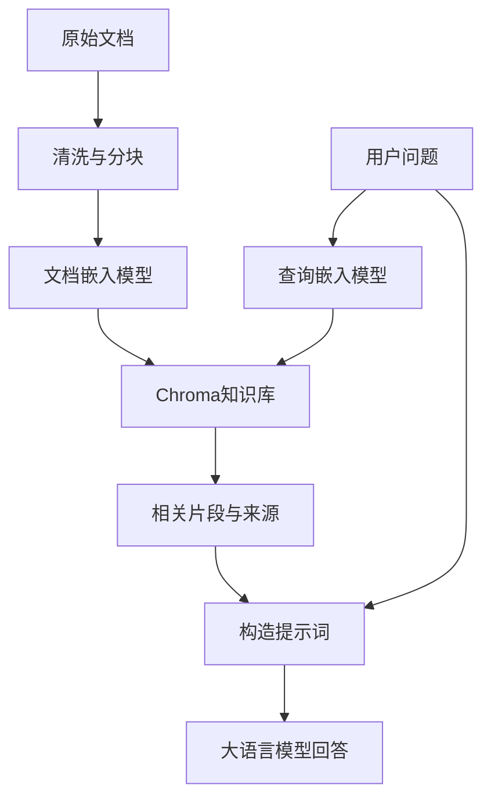

# Chroma 原理与使用指南

> 面向 Python 初学者，介绍向量数据库原理与实际操作。接口依据 2026-10-09 查阅的 Chroma 官方文档；不同版本可能有差异。代码以当前单机 Python API 为主。本文示例已检查语法，未在真实 Chroma 环境中执行；模型首次使用可能需要联网下载。

## 1. Chroma 是什么

Chroma 是用于存储和检索嵌入向量（Embedding）的数据库，常用于语义搜索、知识库和检索增强生成（RAG）。

普通数据库适合查询“编号等于多少”“金额大于多少”；向量数据库擅长查询“哪些内容和这句话的意思接近”。例如，“怎样恢复登录密码”与“忘记密码后的重置步骤”没有完全相同的措辞，但嵌入模型可能把它们映射到相近的位置。

Chroma 负责向量存储、索引、过滤和检索。**文本的语义表达由嵌入模型产生，答案生成由大语言模型完成。** Chroma 可以调用嵌入函数，但它本身不会训练出一个理解业务的语言模型。

| 概念 | 含义 | 示例 |
| --- | --- | --- |
| Client | 访问数据库的客户端 | 内存、本地持久化、HTTP 客户端 |
| Collection | 一组记录及其向量索引，类似表的组织单位 | `knowledge_base` |
| `ids` | Collection 内唯一的记录标识 | `manual_001_chunk_0` |
| `documents` | 保存的原始文本 | 一段使用说明 |
| `embeddings` | 文本对应的数值向量 | `[0.12, -0.34, ...]` |
| `metadatas` | 用于过滤、溯源的业务属性 | `{"source": "manual", "page": 3}` |

Collection 与关系数据库的表只是类比，并不具有完全相同的结构和约束。[1][2]

## 2. 核心原理

### 2.1 文本如何变成向量

嵌入模型接收文本并输出固定维度的浮点数向量：

```text
“如何重置密码” → 嵌入模型 → [0.12, -0.34, 0.56, ...]
```

设有 N 段文档，嵌入维度为 d，则全部文档的向量可以看作形状 `(N, d)` 的矩阵；Q 个查询对应 `(Q, d)` 的矩阵。

每个分量通常没有可直接命名的业务含义。语义信息由多个分量共同表达，不能把某一维简单解释成“水果”“地点”等具体概念。

**建库和查询必须使用相同的嵌入模型及一致的预处理。** 相同维度并不意味着不同模型的向量可以比较。更换模型通常需要重新生成整个 Collection 的向量。

Chroma 默认嵌入函数使用 `all-MiniLM-L6-v2`，在本地运行并可能自动下载模型。它适合快速体验；中文业务应使用经过实际中文检索样本验证的模型。[3]

### 2.2 数据写入和查询

写入时：准备文本及 ID → 生成嵌入 → 保存记录 → 建立或更新向量索引。

查询时：生成查询嵌入 → 按过滤条件限定候选记录 → 利用索引搜索近邻 → 返回相关文本、ID、元数据和距离。

这是逻辑流程，具体执行顺序和存储细节取决于部署方式。一般文本写入与查询可由 Chroma 自动调用 Collection 的嵌入函数；已有向量时也可以直接提供向量。[2]

### 2.3 距离越小，向量越接近

设两个向量为 $a,b$，维度为 $d$。单机索引常见距离如下：[4]

| 配置 | 名称 | 距离公式 |
| --- | --- | --- |
| `l2` | 平方欧氏距离 | $D(a,b)=\sum_{i=1}^{d}(a_i-b_i)^2$ |
| `cosine` | 余弦距离 | $D(a,b)=1-\frac{a\cdot b}{\lVert a\rVert\lVert b\rVert}$ |
| `ip` | 内积距离 | $D(a,b)=1-a\cdot b$ |

注意：Chroma 的 `l2` 使用平方欧氏距离，公式没有开平方。`cosine` 返回的是距离，不是余弦相似度；内积距离可能为负数。

对于同一查询、同一模型和同一距离配置，**距离越小表示向量越接近**。距离不是概率，`1.2` 不能解释为“120% 相似”；不同模型、指标的距离也不能直接比较。

若向量已做单位长度归一化，则平方欧氏距离等于余弦距离的两倍，所以二者的精确距离排序一致。距离指标应结合嵌入模型的使用说明选择。

### 2.4 为什么需要索引

逐一计算查询与 N 个向量的距离需要大约 `O(N × d)` 的计算量。数据量大时，可用近似最近邻（ANN）索引减少搜索量。

单机 Chroma 使用 HNSW：它将向量组织成多层图，上层稀疏，便于快速接近目标区域；下层更密，便于寻找邻近候选。**近似检索不保证每次找到数学上完全精确的最近邻。** 分布式 Chroma 与 Chroma Cloud 的索引实现有所不同，不能把单机 HNSW 描述套用于所有部署。[4]

## 3. 安装与客户端

```bash
python -m pip install chromadb
python -m pip show chromadb
```

建议在虚拟环境中安装；项目验证通过后固定依赖版本。

```python
import chromadb

# 临时内存模式：适合学习、测试，不保存到磁盘
memory_client = chromadb.EphemeralClient()

# 常见快速入门写法，默认设置下使用内存模式
client = chromadb.Client()

# 本地持久化：自动保存到指定目录
persistent_client = chromadb.PersistentClient(path="./chroma_data")

# 连接独立运行的 Chroma 服务
http_client = chromadb.HttpClient(host="localhost", port=8000)
```

持久化目录应使用稳定路径；相对路径取决于程序的工作目录。现代 `PersistentClient` 自动持久化，不需要额外调用旧示例中的 `persist()`。多进程或多服务共享访问时，优先采用独立 Chroma 服务。[1][5]

## 4. 最小可运行示例

以下示例使用内存模式，默认模型首次执行可能下载文件。

```python
import chromadb

client = chromadb.EphemeralClient()
collection = client.create_collection(name="my_collection")

collection.add(
    ids=["id1", "id2"],
    documents=[
        "This is a document about pineapple",
        "This is a document about oranges",
    ],
)

results = collection.query(
    query_texts=["This is a query document about hawaii"],
    n_results=2,
    include=["documents", "metadatas", "distances"],
)

for record_id, document, distance in zip(
    results["ids"][0],
    results["documents"][0],
    results["distances"][0],
):
    print(f"{record_id}: distance={distance:.4f}, text={document}")
```

`add()` 没有传入 `embeddings` 时，Collection 的嵌入函数会计算文档向量；`query_texts` 同样会先转换为查询向量。`n_results=2` 表示每条查询最多取两个近邻。[2]

语义排序不等于常识推理。即使认为 Hawaii 应当与 pineapple 更相关，模型也可能把 oranges 排在前面。精确排名和数值应以实际执行结果为准，不能只凭两个词的常识关系预测。

## 5. 查询结果为什么是二维列表

下面是结构示意，距离和排序只是示例：

```python
{
    "ids": [["id2", "id1"]],
    "documents": [[
        "This is a document about oranges",
        "This is a document about pineapple",
    ]],
    "metadatas": [[None, None]],
    "distances": [[1.1462, 1.3015]],
    "embeddings": None,
}
```

因为 `query()` 支持批量查询，外层列表对应查询，内层列表对应这条查询的检索结果。[2][6]

```python
results["ids"][0]           # 第 1 条查询的全部命中 ID
results["ids"][0][0]        # 第 1 条查询的第 1 个命中 ID
results["documents"][0][0]  # 对应文档
results["distances"][0][0]  # 对应距离
```

如果传入两条查询，结果类似：

```python
query_texts = ["pineapple", "oranges"]
# ids = [[第一条查询的命中ID...], [第二条查询的命中ID...]]
```

`embeddings=None` 一般说明未请求返回该字段，不代表数据库没有向量。需要查看时，把 `"embeddings"` 加入 `include`。`metadatas=[[None, None]]` 表示这些记录没有元数据。返回结构还可能有 `included`、`uris`、`data` 等字段，以实际版本为准。

## 6. 持久化与常用操作

以下代码按顺序执行，使用独立示例 Collection。`upsert()` 便于重复运行。

```python
import chromadb

client = chromadb.PersistentClient(path="./chroma_data")
collection = client.get_or_create_collection(name="learning_notes")

collection.upsert(
    ids=["note_001", "note_002", "note_003"],
    documents=[
        "A convolution layer extracts local image features.",
        "A pooling layer reduces spatial resolution.",
        "A vector database retrieves similar embeddings.",
    ],
    metadatas=[
        {"topic": "cnn", "chapter": 1},
        {"topic": "cnn", "chapter": 2},
        {"topic": "database", "chapter": 3},
    ],
)

print("记录数量：", collection.count())

# 按 ID 读取：不是语义搜索，结果通常是平坦列表
record = collection.get(
    ids=["note_001"],
    include=["documents", "metadatas"],
)
print(record)

# 先限定 topic，再检索近邻
results = collection.query(
    query_texts=["How do image features get extracted?"],
    where={"topic": "cnn"},
    n_results=2,
)
print(results)

# 更新已有记录；仅传新文本时，由嵌入函数重新计算向量
collection.update(
    ids=["note_001"],
    documents=["Convolution layers learn local image features using kernels."],
)

# 精确删除指定记录
collection.delete(ids=["note_003"])
```

| 操作 | 用途 |
| --- | --- |
| `create_collection()` | 创建新 Collection |
| `get_collection()` | 获取已有 Collection |
| `get_or_create_collection()` | 存在则获取，不存在则创建 |
| `add()` | 添加新记录，不应当作更新操作 |
| `update()` | 更新已有记录 |
| `upsert()` | 按 ID 新增或更新 |
| `get()` | 按 ID 或条件读取，不按向量距离排序 |
| `query()` | 检索向量近邻 |
| `count()` | 获取记录数量 |
| `delete()` | 删除指定记录 |

提供的 ID、文档、向量和元数据列表应按位置一一对应，长度保持一致。重复 ID 的具体报错或处理行为可能随版本变化，需要更新时直接使用 `update()` 或 `upsert()`。[1][2]

## 7. 过滤条件

### 7.1 元数据过滤

```python
# 单个属性
where = {"topic": "cnn"}

# 多个条件使用显式 $and
where = {
    "$and": [
        {"topic": {"$eq": "cnn"}},
        {"chapter": {"$gte": 2}},
    ]
}

results = collection.query(
    query_texts=["How does pooling work?"],
    where=where,
    n_results=1,
)
```

常见操作符包括 `$eq`、`$ne`、`$gt`、`$gte`、`$lt`、`$lte`、`$in`、`$nin`，以及组合条件 `$and`、`$or`。保持字段类型一致，例如 `chapter` 都保存成整数。

### 7.2 文本内容过滤

```python
records = collection.get(
    where_document={"$contains": "pooling"},
    include=["documents", "metadatas"],
)
```

`where_document` 的包含判断是文本内容过滤，不代表语义相似。语义相近但没有指定子串的文本可能被排除。过滤可以与向量查询结合使用。[6]

## 8. 显式配置距离指标

当前单机配置写法示例：[4]

```python
collection = client.create_collection(
    name="cosine_notes",
    configuration={"hnsw": {"space": "cosine"}},
)
```

旧教程可能使用 `metadata={"hnsw:space": "cosine"}`。请按安装版本的文档选择写法，避免混用。

`get_or_create_collection()` 取得已有 Collection 时，不应当被当作重新配置已有索引的方式。需要更换距离指标时，通常创建新 Collection 并迁移数据。

## 9. 使用自己生成的向量

下面用人工三维向量展示接口，**这些向量不具有真实语义**，不适合实际知识库。

```python
import chromadb

client = chromadb.EphemeralClient()
collection = client.create_collection(
    name="manual_vectors",
    embedding_function=None,
    configuration={"hnsw": {"space": "l2"}},
)

collection.add(
    ids=["v1", "v2"],
    embeddings=[
        [1.0, 0.0, 0.0],
        [0.0, 1.0, 0.0],
    ],
)

results = collection.query(
    query_embeddings=[[0.9, 0.1, 0.0]],
    n_results=2,
    include=["distances"],
)
print(results)
```

到 `v1` 的平方欧氏距离为 `0.02`，到 `v2` 的距离为 `1.62`，所以 `v1` 更接近。

关闭自动嵌入后，应提供 `embeddings` 和 `query_embeddings`。同一 Collection 内的向量维度必须一致，且查询向量也必须匹配。真实项目用嵌入模型生成向量，不要随机生成向量替代语义表示。

## 10. 中文文本与自定义嵌入模型

下面展示多语言模型接入方式；模型只是接口示例，是否适合业务需要实测。

```bash
python -m pip install sentence-transformers
```

```python
import chromadb
from chromadb.utils import embedding_functions

embedding_fn = embedding_functions.SentenceTransformerEmbeddingFunction(
    model_name="sentence-transformers/paraphrase-multilingual-MiniLM-L12-v2",
)

client = chromadb.PersistentClient(path="./chroma_chinese")
collection = client.get_or_create_collection(
    name="chinese_notes",
    embedding_function=embedding_fn,
    configuration={"hnsw": {"space": "cosine"}},
)

collection.upsert(
    ids=["cnn_001", "cnn_002"],
    documents=[
        "卷积层通过可学习的卷积核提取图像的局部特征。",
        "池化层通过局部聚合缩小特征图的空间尺寸。",
    ],
)

results = collection.query(
    query_texts=["哪一层用于缩小特征图？"],
    n_results=1,
)
print(results["documents"][0])
```

部分模型要求查询前缀、文档前缀或特定归一化策略，需要按模型说明实现。不要让不同脚本使用不同模型向同一个 Collection 写入；如有旧数据，确认其模型一致后再复用。[3]

## 11. Chroma 在 RAG 中的作用

RAG 是检索增强生成：先检索参考材料，再让大语言模型基于材料回答。



长文档通常先拆成语义相对完整的片段，每段分配稳定 ID，元数据记录文件名、页码和块编号。Chroma 不会自动替你完成可靠的 PDF 解析、文本清洗和分块。

获得结果后，可以构造提示词：

```python
# results 由中文知识库查询得到
question = "哪一层用于缩小特征图？"
context = "\n\n".join(results["documents"][0])
prompt = f"""请依据参考资料回答；资料不足时说明无法确定。

参考资料：
{context}

问题：{question}
"""
print(prompt)
# 下一步：把 prompt 传给你使用的大语言模型
```

取到 Top-K 结果并不代表它们都能回答问题。实际应用应保留来源，使用真实问题评估召回质量，必要时增加距离阈值或重排序；阈值要针对自己的模型和数据校准。

## 12. 常见问题与排查

| 问题 | 常见原因 | 处理方式 |
| --- | --- | --- |
| 重启后数据不见 | 使用内存客户端 | 使用 `PersistentClient` 并固定目录 |
| 首次写入很慢 | 嵌入模型下载或初始化 | 预先下载模型，区分嵌入时间和检索时间 |
| 向量维度不匹配 | 换模型或错误的查询向量 | 使用一致模型，必要时重建 Collection |
| 中文排序不理想 | 模型、分块或查询表达不适合任务 | 用中文检索样本评估并调整 |
| `embeddings` 为 `None` | 没有包含返回字段 | 在 `include` 中指定 `embeddings` |
| 重复运行产生 ID 问题 | 把 `add()` 当作更新 | 使用稳定 ID 和 `upsert()` |
| 过滤后没有结果 | 属性值、类型、文本条件不匹配 | 先用 `get()` 检查记录与元数据 |
| 长文档遗漏关键信息 | 模型输入长度限制或分块不当 | 清洗、分块，保留出处 |
| 返回片段相关但答案错误 | 召回不足或生成模型偏离资料 | 检查片段、提示词和生成结果 |

单机 HNSW 索引需要考虑内存容量，持久化到磁盘不意味着检索完全不占内存。规划资源时同时考虑向量数量、维度、索引结构和文档大小，不宜直接套用固定的“可容纳多少条”结论。[7]

## 13. 速记

**文本 → 嵌入向量 → Chroma 存储与索引 → 问题向量 → 检索相关片段。**

- `documents` 是原文，`embeddings` 是原文的向量表示。
- `get()` 用于按 ID 或条件读取，`query()` 用于向量近邻检索。
- 查询结果外层对应问题，内层对应该问题的命中记录。
- 距离越小表示向量越接近，不代表答案一定正确。
- 实际知识库应使用一致模型、合理分块、稳定 ID 和可追溯元数据。

## 14. 官方参考资料

1. [Python Client API](https://docs.trychroma.com/reference/python)
2. [Python Collection API](https://docs.trychroma.com/reference/python/collection)
3. [Embedding Functions](https://docs.trychroma.com/docs/embeddings/embedding-functions)
4. [Configure Collections](https://docs.trychroma.com/docs/collections/configure)
5. [Chroma Clients](https://docs.trychroma.com/docs/run-chroma/cloud-client)
6. [Query and Get](https://docs.trychroma.com/docs/querying-collections/query-and-get)
7. [Single-Node Performance](https://docs.trychroma.com/guides/deploy/performance)
