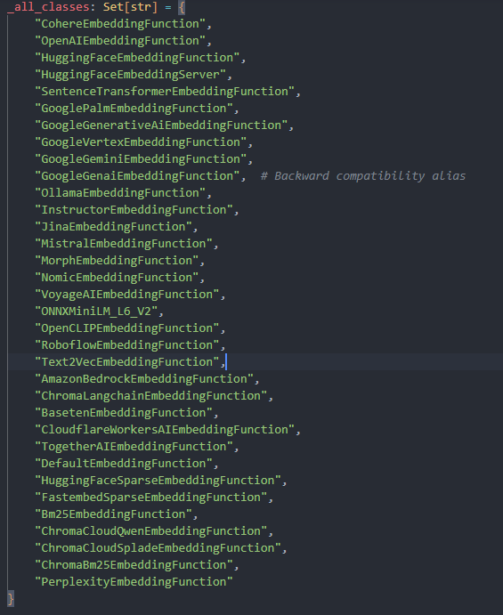

学习如何在 Chroma 中使用嵌入函数，为你的数据创建向量表示。

嵌入（Embeddings）是数据的数值表示，它以 AI 模型能够处理的形式捕捉数据的含义。它们可以表示文本、图像，并最终支持音频和视频。Chroma 会存储并索引这些嵌入，以便你能够高效地搜索相似内容。你既可以通过已安装的库在本地生成它们，也可以通过 API 远程生成。
## Embedding Functions
### 1 使用外置的embedding服务
比如使用openAI的Embedding服务
```python
# Set your OPENAI_API_KEY environment variable
from chromadb.utils.embedding_functions import OpenAIEmbeddingFunction

collection = client.create_collection(
    name="my_collection",
    embedding_function=OpenAIEmbeddingFunction(
        model_name="text-embedding-3-small"
    )
)

# Chroma will use OpenAIEmbeddingFunction to embed your documents
collection.add(
    ids=["id1", "id2"],
    documents=["doc1", "doc2"]
)
```
chroma可以调用外部的Embedding服务


### 2. chroma内置默认的Embedding方法
```python
import chromadb
from chromadb import Embeddings

client = chromadb.Client()
collection = client.get_or_create_collection("my_collection")
print(collection.configuration)
"""
{
  "hnsw": {
    "space": "l2",
    "ef_construction": 100,
    "ef_search": 100,
    "max_neighbors": 16,
    "resize_factor": 1.2,
    "sync_threshold": 1000
  },
  "spann": null,
  "embedding_function": "<chromadb.api.types.DefaultEmbeddingFunction object>"
}
"""
```

```python
class DefaultEmbeddingFunction(EmbeddingFunction[Documents]):
    """Default embedding function that delegates to ONNXMiniLM_L6_V2."""

    def __init__(self) -> None:
        if is_thin_client:
            return

    def __call__(self, input: Documents) -> Embeddings:
        # Import here to avoid circular imports
        from chromadb.utils.embedding_functions.onnx_mini_lm_l6_v2 import (
            ONNXMiniLM_L6_V2,
        )

        return ONNXMiniLM_L6_V2()(input)
```

直接调用默认的Embedding方法
```python
from chromadb.utils.embedding_functions import DefaultEmbeddingFunction

default_embedding_fn = DefaultEmbeddingFunction()
embeddings = default_embedding_fn(["wulei"])
print(embeddings)
```
> [array([-6.67368174e-02,  3.49207148e-02, -5.98042458e-02,  6.82153106e-02,  -8.71369243e-02, -5.99468760e-02,  1.62543476e-01 ...])]

### 3. 使用自定义的Embedding

```python

# 2. 怎么去自定义embedding算法
# 参考 DefaultEmbeddingFunction的写法
class MyEmbeddingFunction(EmbeddingFunction[Documents]):

    def __init__(self, model):
        self.model = model

    def __call__(self, input: Documents) -> Embeddings:
        # embed the documents somehow
        # 我这里写一个非常简单的embedding方案，所有的Document都返回[1,2,3]
        embeddings = [np.array([1, 2, 3]) for item in input]
        return embeddings


# 现在创建一个collection然后指定我自己定义的 Embedding函数
my_collection = client.get_or_create_collection(
    name="custom_embedding",
    embedding_function=MyEmbeddingFunction(model=None),
)

my_collection.add(
    ids=["id1", "id2", "id3"],
    documents=[
        "This is a document about pineapple",
        "This is a document about oranges",
        "This is a document about dogs",
    ],
)

print(my_collection.peek())
"""
{
  "ids": ["id1", "id2", "id3"],
  "embeddings": [
    [1.0, 2.0, 3.0],
    [1.0, 2.0, 3.0],
    [1.0, 2.0, 3.0]
  ],
  "documents": [
    "This is a document about pineapple",
    "This is a document about oranges",
    "This is a document about dogs"
  ],
  "uris": null,
  "included": ["metadatas", "documents", "embeddings"],
  "data": null,
  "metadatas": [null, null, null]
}
"""
```
